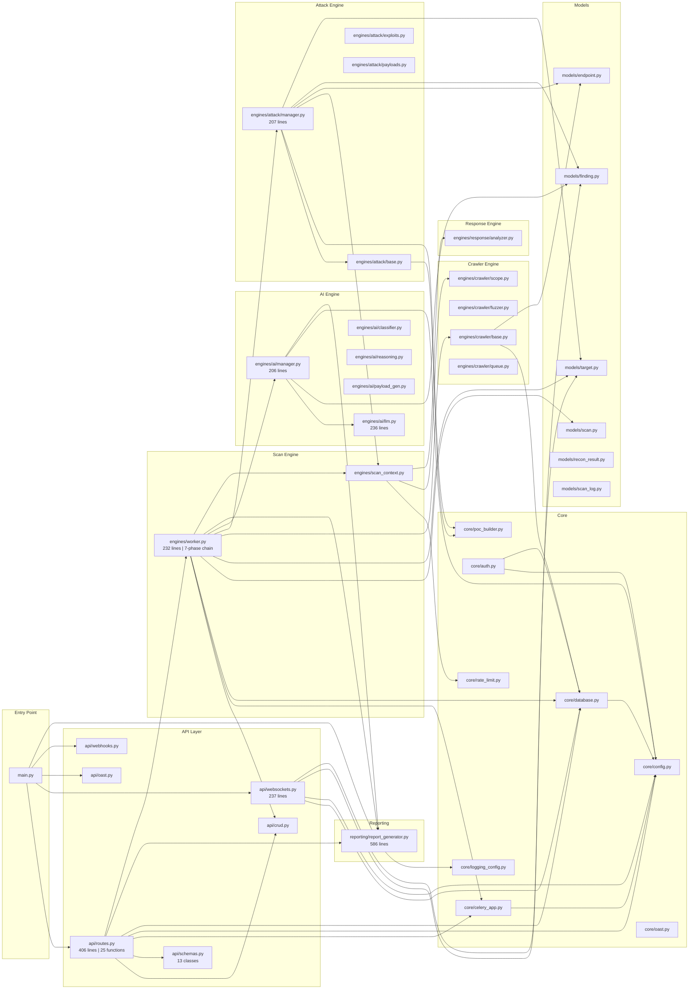

# AWAPT-AI — Code Review Graph & Dependency Analysis

**Generated:** May 2026 | **Backend LOC:** 5,530 | **Total Classes:** 66 | **Total Functions:** 215

---

## 1. Codebase Summary

| Metric | Value |
|--------|-------|
| **Backend Python LOC** | 5,530 |
| **Frontend TypeScript LOC** | ~5,000+ |
| **Total Source Files (Backend)** | 44 Python files |
| **Total Classes** | 66 |
| **Total Functions / Methods** | 215 |
| **Attack Modules** | 19 |
| **ORM Data Models** | 7 |
| **API Endpoints** | 25 REST + 2 WebSocket |
| **External Libraries** | 31 (Python) + 20 (Node.js) |
| **Internal Dependencies** | 82 cross-module imports |

---

## 2. File-Level Metrics

### Backend Core (`awap/`)

| File | Lines | Imports | Classes | Functions | Complexity |
|------|------:|--------:|--------:|----------:|------------|
| **API Layer** | | | | | |
| `api/routes.py` | 406 | 10 | 0 | 25 | 🔴 High |
| `api/websockets.py` | 237 | 7 | 1 | 5 | 🟡 Medium |
| `api/schemas.py` | 144 | 4 | 13 | 1 | 🟢 Low |
| `api/crud.py` | 84 | 6 | 0 | 10 | 🟢 Low |
| `api/oast.py` | 34 | 2 | 0 | 2 | 🟢 Low |
| `api/webhooks.py` | 58 | 6 | 0 | 2 | 🟢 Low |
| **Core Infrastructure** | | | | | |
| `core/config.py` | 54 | 2 | 1 | 1 | 🟢 Low |
| `core/database.py` | 30 | 3 | 0 | 1 | 🟢 Low |
| `core/celery_app.py` | 14 | 2 | 0 | 0 | 🟢 Low |
| `core/auth.py` | 59 | 6 | 0 | 4 | 🟡 Medium |
| `core/rate_limit.py` | 23 | 2 | 1 | 1 | 🟢 Low |
| `core/oast.py` | 61 | 4 | 2 | 4 | 🟢 Low |
| `core/poc_builder.py` | 209 | 5 | 0 | 8 | 🟡 Medium |
| `core/exploit_gen.py` | 16 | 3 | 0 | 1 | 🟢 Low |
| `core/logging_config.py` | 42 | 3 | 0 | 1 | 🟢 Low |
| **Scan Engines** | | | | | |
| `engines/worker.py` | 232 | 6 | 0 | 17 | 🔴 High |
| `engines/scan_context.py` | 53 | 4 | 1 | 1 | 🟢 Low |
| **AI/ML Engine** | | | | | |
| `engines/ai/llm.py` | 236 | 3 | 1 | 4 | 🔴 High |
| `engines/ai/manager.py` | 206 | 5 | 1 | 4 | 🔴 High |
| `engines/ai/classifier.py` | 87 | 2 | 1 | 1 | 🟡 Medium |
| `engines/ai/reasoning.py` | 110 | 4 | 1 | 4 | 🟡 Medium |
| `engines/ai/payload_gen.py` | 87 | 3 | 1 | 4 | 🟡 Medium |
| **Attack Engine** | | | | | |
| `engines/attack/base.py` | 105 | 4 | 1 | 4 | 🟡 Medium |
| `engines/attack/manager.py` | 207 | 7 | 0 | 4 | 🔴 High |
| `engines/attack/exploits.py` | 145 | 4 | 1 | 3 | 🟡 Medium |
| `engines/attack/payloads.py` | 145 | 2 | 1 | 4 | 🟡 Medium |
| **Crawler Engine** | | | | | |
| `engines/crawler/base.py` | 130 | 7 | 0 | 7 | 🟡 Medium |
| `engines/crawler/crawler.py` | 118 | 5 | 1 | 5 | 🟡 Medium |
| `engines/crawler/fuzzer.py` | 123 | 4 | 1 | 6 | 🟡 Medium |
| `engines/crawler/queue.py` | 81 | 3 | 2 | 5 | 🟢 Low |
| `engines/crawler/scope.py` | 32 | 1 | 1 | 1 | 🟢 Low |
| `engines/crawler/types.py` | 30 | 2 | 5 | 0 | 🟢 Low |
| **Response Engine** | | | | | |
| `engines/response/analyzer.py` | 116 | 4 | 1 | 3 | 🟡 Medium |
| **Reporting** | | | | | |
| `reporting/report_generator.py` | 586 | 12 | 1 | 16 | 🔴 High |
| **Data Models** | | | | | |
| `models/target.py` | 20 | 4 | 1 | 0 | 🟢 Low |
| `models/scan.py` | 27 | 4 | 1 | 0 | 🟢 Low |
| `models/finding.py` | 38 | 4 | 1 | 0 | 🟢 Low |
| `models/endpoint.py` | 21 | 4 | 1 | 0 | 🟢 Low |
| `models/recon_result.py` | 20 | 4 | 1 | 0 | 🟢 Low |
| `models/scan_log.py` | 22 | 4 | 1 | 0 | 🟢 Low |
| `models/user.py` | 22 | 4 | 2 | 0 | 🟢 Low |

### Vulnerability Modules (`modules/`)

| Module | Lines | Vuln Class | Base Class | Complexity |
|--------|------:|-----------|------------|------------|
| `sqli_error.py` | 54 | SQL_INJECTION | AttackModule | 🟢 Low |
| `sqli_time_based.py` | 55 | SQL_INJECTION | AttackModule | 🟢 Low |
| `xss_reflected.py` | 52 | XSS_REFLECTED | AttackModule | 🟢 Low |
| `xss_dom.py` | 110 | XSS_DOM | AttackModule | 🟡 Medium |
| `ssrf.py` | 48 | SSRF | AttackModule | 🟢 Low |
| `ssrf_blind.py` | 47 | SSRF_BLIND | AttackModule | 🟢 Low |
| `cmd_injection.py` | 50 | CMD_INJECTION | AttackModule | 🟢 Low |
| `nosql_injection.py` | 82 | NOSQL_INJECTION | AttackModule | 🟡 Medium |
| `idor.py` | 76 | IDOR | AttackModule | 🟡 Medium |
| `path_traversal.py` | 49 | PATH_TRAVERSAL | AttackModule | 🟢 Low |
| `open_redirect.py` | 46 | OPEN_REDIRECT | AttackModule | 🟢 Low |
| `cors_misconfig.py` | 34 | CORS_MISCONFIG | AttackModule | 🟢 Low |
| `jwt_attacks.py` | 44 | JWT_ATTACK | AttackModule | 🟢 Low |
| `security_headers.py` | 35 | SECURITY_HEADERS | AttackModule | 🟢 Low |
| `subdomain_takeover.py` | 42 | SUBDOMAIN_TAKEOVER | AttackModule | 🟢 Low |
| `cloud_leak.py` | 54 | CLOUD_LEAK | AttackModule | 🟢 Low |
| `graphql_introspection.py` | 42 | GRAPHQL_INTROSPECTION | AttackModule | 🟢 Low |
| `prototype_pollution.py` | 50 | PROTOTYPE_POLLUTION | AttackModule | 🟢 Low |
| `llm_prompt_injection.py` | 52 | LLM_PROMPT_INJECTION | AttackModule | 🟢 Low |

---

## 3. Internal Dependency Graph

### Module-to-Module Dependencies (82 edges)



---

## 4. Class Hierarchy & Inheritance Tree

```
                              ┌───────────────────┐
                              │    AttackModule    │  (ABC - Abstract Base Class)
                              │  base.py (105 ln)  │
                              │                    │
                              │  + module_id       │
                              │  + vuln_class      │
                              │  + send_payload()  │
                              │  + analyze_with_rae│
                              │  + run() [abstract]│
                              └────────┬───────────┘
                                       │
            ┌──────────────────────────┬┼─────────────────────────────┐
            │                          ││                             │
    ┌───────┴────────┐   ┌─────────────┴┴──────────┐   ┌─────────────┴──────────┐
    │ SQLiErrorModule│   │ XSSDOMModule             │   │ SSRFModule             │
    │ sqli_error.py  │   │ xss_dom.py (110 ln)      │   │ ssrf.py                │
    │                │   │                           │   │                        │
    │ PAYLOADS: 7    │   │ PAYLOADS: 5               │   │ PAYLOADS: 2            │
    │ SIGNATURES: 8  │   │ + Playwright verification │   │ + metadata detection   │
    └────────────────┘   └───────────────────────────┘   └────────────────────────┘
            │                          │                             │
    ┌───────┴────────┐   ┌─────────────┴───────────┐   ┌─────────────┴──────────┐
    │SQLiTimeModule  │   │ XSSReflectedModule       │   │ SSRFBlindModule        │
    │sqli_time.py    │   │ xss_reflected.py         │   │ ssrf_blind.py          │
    └────────────────┘   └─────────────────────────┘   │ + OAST integration     │
            │                          │                └────────────────────────┘
    ┌───────┴────────┐   ┌─────────────┴───────────┐            │
    │CmdInjModule    │   │ CORSModule              │   ┌────────┴───────────────┐
    │cmd_injection.py│   │ cors_misconfig.py       │   │ IDORModule             │
    │ + OAST         │   └─────────────────────────┘   │ idor.py                │
    └────────────────┘            │                    └────────────────────────┘
            │            ┌────────┴────────────────┐            │
    ┌───────┴────────┐   │NoSQLInjectionModule     │   ┌────────┴───────────────┐
    │PathTraversalMod│   │nosql_injection.py       │   │JWTNoneAlgorithmModule  │
    │path_traversal  │   └─────────────────────────┘   │jwt_attacks.py          │
    └────────────────┘            │                    └────────────────────────┘
            │            ┌────────┴────────────────┐            │
    ┌───────┴────────┐   │OpenRedirectModule       │   ┌────────┴───────────────┐
    │SecurityHeaders │   │open_redirect.py         │   │GraphQLIntrospModule    │
    │security_hdr.py │   └─────────────────────────┘   │graphql_introspection   │
    └────────────────┘            │                    └────────────────────────┘
            │            ┌────────┴────────────────┐            │
    ┌───────┴────────┐   │SubdomainTakeoverModule  │   ┌────────┴───────────────┐
    │CloudLeakModule │   │subdomain_takeover.py    │   │PrototypePollutionMod   │
    │cloud_leak.py   │   └─────────────────────────┘   │prototype_pollution.py  │
    └────────────────┘                                  └────────────────────────┘
                                                                │
                                                        ┌───────┴───────────────┐
                                                        │LLMPromptInjectionMod  │
                                                        │llm_prompt_injection   │
                                                        └───────────────────────┘
```

---

## 5. Data Model Relationships (ORM)

```
┌─────────────────┐  1:N   ┌─────────────────┐  1:N   ┌─────────────────┐
│     Target      │───────→│      Scan       │───────→│    Endpoint     │
│                 │        │                 │        │                 │
│ PK: id (UUID)   │        │ PK: id (UUID)   │        │ PK: id (UUID)   │
│ domain          │        │ FK: target_id   │        │ FK: scan_id     │
│ scope_rules []  │        │ state (FSM)     │        │ url             │
│ authorized      │        │ profile         │        │ method          │
│ authorized_at   │        │ progress 0-100  │        │ params []       │
│ created_at      │        │ error_message   │        │ source          │
└─────────────────┘        │ started_at      │        │ discovered_at   │
                           │ completed_at    │        └─────────────────┘
                           │ created_at      │
                           └────────┬────────┘
                                    │
                        ┌───────────┼───────────┐
                        │ 1:N       │ 1:N       │ 1:N
                        ▼           ▼           ▼
                ┌───────────┐ ┌──────────┐ ┌──────────────┐
                │  Finding  │ │ ScanLog  │ │ ReconResult  │
                │           │ │          │ │              │
                │ PK: id    │ │ PK: id   │ │ PK: id       │
                │ FK: scan  │ │ FK: scan │ │ FK: scan_id  │
                │ vuln_class│ │ level    │ │ type         │
                │ severity  │ │ message  │ │ data (JSONB) │
                │ cvss_score│ │ metadata │ │ source       │
                │ cvss_vect │ │ logged_at│ └──────────────┘
                │ cwe_id    │ └──────────┘
                │ url       │
                │ method    │              ┌──────────────┐
                │ param     │              │    User      │
                │ param_type│              │              │
                │ payload   │              │ PK: id       │
                │ evidence  │              │ username     │
                │ request_r │              │ hashed_pwd   │
                │ response_r│              │ role (enum)  │
                │ descript  │              │ created_at   │
                │ remediat  │              └──────────────┘
                │ impact    │
                │ steps_repr│
                │ poc_artif │
                │ confidence│
                │ false_pos │
                │ confirmed │
                │ discover  │
                └───────────┘
```

---

## 6. External Library Dependency Map

### Python Backend (31 packages)

```
┌─────────────────────────────────────────────────────────────────────┐
│                     External Dependencies                            │
│                                                                     │
│  ┌── Web Framework ──────────────┐  ┌── Task Queue ──────────────┐  │
│  │  fastapi                      │  │  celery                    │  │
│  │  uvicorn                      │  │  redis                     │  │
│  │  pydantic / pydantic-settings │  │  flower (monitoring)       │  │
│  │  python-multipart             │  └────────────────────────────┘  │
│  └───────────────────────────────┘                                  │
│                                                                     │
│  ┌── Database ───────────────────┐  ┌── HTTP / Network ──────────┐  │
│  │  sqlalchemy[asyncio]          │  │  httpx (async HTTP)        │  │
│  │  asyncpg                      │  │  aiohttp                   │  │
│  │  psycopg2-binary              │  │  requests                  │  │
│  │  aiosqlite                    │  │  dnspython                 │  │
│  │  alembic                      │  │  dnslib                    │  │
│  └───────────────────────────────┘  └────────────────────────────┘  │
│                                                                     │
│  ┌── AI / ML ────────────────────┐  ┌── Security ────────────────┐  │
│  │  openai (GPT SDK)             │  │  pyjwt                     │  │
│  │  anthropic (Claude SDK)       │  │  python-jose[cryptography] │  │
│  │  transformers (HuggingFace)   │  │  passlib[bcrypt]           │  │
│  │  scikit-learn                 │  │  pycryptodome              │  │
│  │  numpy                        │  └────────────────────────────┘  │
│  │  networkx                     │                                  │
│  └───────────────────────────────┘  ┌── Reporting ───────────────┐  │
│                                     │  reportlab (PDF)           │  │
│  ┌── Browser Automation ─────────┐  │  BeautifulSoup4            │  │
│  │  playwright (Chromium)        │  └────────────────────────────┘  │
│  └───────────────────────────────┘                                  │
└─────────────────────────────────────────────────────────────────────┘
```

### Frontend Node.js (20 packages)

```
┌─────────────────────────────────────────────────────────────────────┐
│                     Frontend Dependencies                            │
│                                                                     │
│  ┌── Core ───────────────────────┐  ┌── State & Data ────────────┐  │
│  │  react 19                     │  │  zustand 5                 │  │
│  │  react-dom 19                 │  │  @tanstack/react-query 5   │  │
│  │  react-router-dom 7           │  │  axios                     │  │
│  │  typescript 5.9               │  └────────────────────────────┘  │
│  └───────────────────────────────┘                                  │
│                                                                     │
│  ┌── Visualization ──────────────┐  ┌── UI / Animation ──────────┐  │
│  │  recharts 3 (charts)          │  │  framer-motion             │  │
│  │  cytoscape.js (attack graph)  │  │  lucide-react (icons)      │  │
│  │  d3-force (graph physics)     │  │  tailwindcss 4             │  │
│  │  react-syntax-highlighter     │  │  clsx, tailwind-merge      │  │
│  └───────────────────────────────┘  └────────────────────────────┘  │
│                                                                     │
│  ┌── Terminal ───────────────────┐  ┌── Build ───────────────────┐  │
│  │  @xterm/xterm 6               │  │  vite 7                    │  │
│  │  @xterm/addon-fit             │  │  @vitejs/plugin-react      │  │
│  └───────────────────────────────┘  └────────────────────────────┘  │
└─────────────────────────────────────────────────────────────────────┘
```

---

## 7. Scan Execution Flow Graph

```
User → POST /api/v1/scans
         │
         ▼
    ┌─────────────────────────────────────────────────────────┐
    │                 routes.py::create_scan()                 │
    │  1. Verify target.authorized == True                    │
    │  2. crud.create_scan() → DB insert                      │
    │  3. run_scope_task.delay(scan_id, target_id)            │
    └────────────────────┬────────────────────────────────────┘
                         │
                    Celery Queue
                         │
    ┌────────────────────┴────────────────────────────────────┐
    │              worker.py — CELERY TASK CHAIN               │
    │                                                          │
    │  ┌─────────────┐                                        │
    │  │ SCOPE (5%)  │ Verify target auth + scope rules       │
    │  │ max_retry:3 │ → ScopeEnforcer validation             │
    │  └──────┬──────┘                                        │
    │         │ .delay()                                      │
    │  ┌──────┴──────┐                                        │
    │  │ RECON (15%) │ crt.sh + DNS + fingerprint + portscan  │
    │  │ max_retry:3 │ → ReconResult rows inserted            │
    │  └──────┬──────┘                                        │
    │         │ .delay()                                      │
    │  ┌──────┴──────┐                                        │
    │  │ CRAWL (35%) │ Playwright headless browser            │
    │  │ max_retry:3 │ → Endpoint rows inserted               │
    │  └──────┬──────┘                                        │
    │         │ .delay()                                      │
    │  ┌──────┴──────┐                                        │
    │  │ MAP  (45%)  │ ParameterFuzzer binary search          │
    │  │ max_retry:3 │ → Endpoint.params updated              │
    │  └──────┬──────┘                                        │
    │         │ .delay()                                      │
    │  ┌──────┴──────┐                                        │
    │  │ATTACK (60%) │ 19 modules × N endpoints concurrent    │
    │  │ max_retry:3 │ → Finding rows inserted                │
    │  │             │ → Redis FINDING events published        │
    │  └──────┬──────┘                                        │
    │         │ .delay()                                      │
    │  ┌──────┴──────┐                                        │
    │  │ AI   (80%)  │ AIDecisionEngine.classify_finding()    │
    │  │ max_retry:3 │ → Finding CVSS/severity/CWE updated   │
    │  │             │ → PoC artifacts generated               │
    │  └──────┬──────┘                                        │
    │         │ .delay()                                      │
    │  ┌──────┴──────┐                                        │
    │  │REPORT (95%) │ PDF + MD + CSV + JSON + Bounty         │
    │  │ max_retry:3 │ → reports/{scan_id}/ directory         │
    │  └──────┬──────┘                                        │
    │         │                                               │
    │  ┌──────┴──────┐                                        │
    │  │COMPLETE 100%│ Final state + WebSocket broadcast       │
    │  └─────────────┘                                        │
    └─────────────────────────────────────────────────────────┘
```

---

## 8. AI Pipeline Decision Flow

```
Finding (raw from Attack Engine)
    │
    ▼
┌─────────────────────────────┐
│   LLM API Key configured?  │
└──────────┬──────────────────┘
           │
     ┌─────┴─────┐
     │           │
    YES          NO
     │           │
     ▼           ▼
┌──────────┐  ┌──────────────────────┐
│ LLM Path │  │ Rule-Based Fallback  │
│          │  │                      │
│ Prompt:  │  │ CVSS_BY_VULN lookup  │
│ "Analyze │  │ CWE_BY_VULN lookup   │
│ finding, │  │ Severity threshold   │
│ return   │  │ Template description │
│ JSON..." │  │ Template remediation │
│          │  │ FP probability calc  │
│ Parse    │  │                      │
│ response │  │ confidence = 0.95    │
│ as JSON  │  │ if evidence present  │
│          │  │ else 0.55 (uncertain)│
└────┬─────┘  └──────────┬───────────┘
     │                   │
     ▼                   ▼
┌──────────────────────────────┐
│    Enriched Finding          │
│                              │
│  + vuln_class (confirmed)    │
│  + severity                  │
│  + cvss_score (0-10)         │
│  + cvss_vector (CVSS:3.1/…) │
│  + cwe_id                    │
│  + description               │
│  + remediation               │
│  + false_positive_probability│
│  + impact statement          │
│  + PoC artifacts (curl/py/…) │
│  + steps_to_reproduce        │
└──────────────────────────────┘
```

---

## 9. High Coupling Hotspots

The following files have the most internal dependencies (potential refactoring targets):

| File | Inbound Deps | Outbound Deps | Risk |
|------|:------------:|:-------------:|------|
| `core/config.py` | 12 files import it | 0 | 🟢 Healthy (config singleton) |
| `core/database.py` | 8 files import it | 1 | 🟢 Healthy (DB singleton) |
| `core/poc_builder.py` | 3 files import it | 0 | 🟢 Healthy (utility) |
| `engines/attack/base.py` | 19 modules import it | 1 | 🟢 Healthy (plugin interface) |
| `models/finding.py` | 5 files import it | 0 | 🟢 Healthy (data model) |
| `models/scan.py` | 4 files import it | 0 | 🟢 Healthy (data model) |
| `models/target.py` | 5 files import it | 0 | 🟢 Healthy (data model) |
| `engines/worker.py` | 2 files import it | 6 | 🟡 Monitor (orchestrator) |
| `api/routes.py` | 1 file imports it | 7 | 🟡 Monitor (large surface) |
| `reporting/report_generator.py` | 3 files import it | 5 | 🟡 Monitor (586 lines) |
| `engines/attack/manager.py` | 1 file imports it | 6 | 🟡 Monitor (complex logic) |

---

## 10. Code Quality Assessment

### Strengths

| Area | Details |
|------|---------|
| **Plugin Architecture** | Attack modules follow clean ABC pattern — zero modification to add new vuln scanners |
| **Separation of Concerns** | Clear layer boundaries: API → Engine → Model → DB |
| **Async Throughout** | Full async/await from API through DB and HTTP clients |
| **Dual-Mode AI** | Graceful LLM → rule-based fallback ensures offline functionality |
| **Deduplication** | SHA-256 based finding deduplication prevents noise |
| **Rate Limiting** | Built-in per-target rate control with 429 backoff |
| **Evidence Generation** | Every finding produces reproducible PoC artifacts |

### Improvement Opportunities

| Area | Recommendation | Priority |
|------|---------------|----------|
| `report_generator.py` (586 ln) | Split into separate template classes | 🟡 Medium |
| `api/routes.py` (406 ln) | Extract report routes into separate router | 🟡 Medium |
| `engines/worker.py` | Consider Celery chord/chain primitives | 🟢 Low |
| Test Coverage | `tests/` directory exists but empty | 🔴 High |
| Type Annotations | Some functions lack return type hints | 🟢 Low |
| Error Handling | Some bare `except: pass` in crawler | 🟡 Medium |

---

## 11. Frontend Component Graph

```
App.tsx (Root Router)
├── DashboardLayout.tsx (Sidebar + Header)
│   ├── /dashboard    → Dashboard.tsx (9.8KB)
│   │                    ├── Severity cards
│   │                    ├── Recent findings
│   │                    └── Active scan status
│   │
│   ├── /targets      → Targets.tsx (12.6KB)
│   │                    ├── Target CRUD form
│   │                    ├── Authorization toggle
│   │                    └── Scope rules editor
│   │
│   ├── /scans        → LiveMonitor.tsx (21.9KB)
│   │                    ├── WebSocket connection (useScanMonitor hook)
│   │                    ├── Phase progress timeline
│   │                    ├── Real-time log stream
│   │                    └── Cytoscape attack graph
│   │
│   ├── /findings     → Findings.tsx (26.6KB — largest page)
│   │                    ├── Filterable findings table
│   │                    ├── Severity badge system
│   │                    ├── PoC artifact viewer
│   │                    ├── xterm.js exploit console
│   │                    └── Finding PATCH editor
│   │
│   ├── /reports      → Reports.tsx (14.6KB)
│   │                    ├── Template selector (exec/tech/compliance/bounty)
│   │                    ├── Report preview panel
│   │                    └── PDF/MD/CSV/JSON download
│   │
│   ├── /analytics    → Analytics.tsx (6.5KB)
│   │                    └── Recharts severity distribution
│   │
│   └── /settings     → Settings.tsx (28.5KB — most complex page)
│                        ├── LLM provider configuration
│                        ├── Scan profile settings
│                        ├── Rate limit controls
│                        └── OAST server setup

State Management:
├── useScanStore.ts    (Zustand — scan lifecycle)
├── useTargetStore.ts  (Zustand — target CRUD)
├── useFindingStore.ts (Zustand — finding management)
└── useThemeStore.ts   (Zustand — dark/light theme)

Data Hooks:
├── useScanMonitor.ts  (WebSocket real-time subscription)
└── useTargets.ts      (React Query data fetching)
```

---

## 12. Security Architecture Review

```
┌──────────────────────────────────────────────────────────────────┐
│                    Security Control Points                        │
│                                                                  │
│  1. TARGET AUTHORIZATION                                         │
│     routes.py:41 — Target.authorized must be True                │
│     → 403 Forbidden if not authorized                            │
│                                                                  │
│  2. SCOPE ENFORCEMENT                                            │
│     scan_context.py → ScopeEnforcer                              │
│     attack/base.py:41 — Every send_payload() checks scope        │
│     attack/manager.py:97 — Endpoint filtered before attack       │
│     crawler/base.py:28 — Links validated against target domain   │
│                                                                  │
│  3. RATE LIMITING                                                │
│     core/rate_limit.py → TargetRateLimiter                       │
│     attack/base.py:45 — await context.rate_limiter.acquire()     │
│     429 auto-retry with 2s backoff                               │
│                                                                  │
│  4. TIMEOUT PROTECTION                                           │
│     attack/manager.py:111 — asyncio.wait_for(timeout=15.0)      │
│     crawler/base.py:106 — page.goto(timeout=15000)              │
│                                                                  │
│  5. CONCURRENCY CONTROL                                          │
│     attack/manager.py:90 — Semaphore(MAX_CONCURRENT_CONNECTIONS) │
│                                                                  │
│  6. CRAWLER SAFETY                                               │
│     crawler/base.py:33 — Blocks logout/signout/delete URLs       │
│     crawler/base.py:99 — max_pages limit enforced                │
│                                                                  │
│  7. RETRY LIMITS                                                 │
│     worker.py — max_retries=3 per phase, 30s countdown           │
│                                                                  │
│  8. ERROR ISOLATION                                              │
│     attack/manager.py:127 — Individual module failures caught    │
│     worker.py:171 — Phase errors → FAILED state, not crash       │
└──────────────────────────────────────────────────────────────────┘
```

---

*Generated by automated code analysis of the AWAPT-AI repository — 5,530 lines of Python backend code across 44 files, with 66 classes and 215 functions.*
