# AWAPT-AI: Autonomous Web Application Penetration Testing with Artificial Intelligence

## Complete System Architecture & Technical Specification

**Version:** 1.1.0  
**Classification:** Research Paper — Full Technical Reference  
**Authors:** AWAPT-AI Development Team  
**Date:** May 2026

---

## Table of Contents

1. [Abstract](#1-abstract)
2. [System Overview](#2-system-overview)
3. [High-Level Architecture](#3-high-level-architecture)
4. [Technology Stack](#4-technology-stack)
5. [Project Directory Structure](#5-project-directory-structure)
6. [Core Subsystem Architecture](#6-core-subsystem-architecture)
   - 6.1 [Scan Orchestration Engine (State Machine)](#61-scan-orchestration-engine-state-machine)
   - 6.2 [Reconnaissance Engine](#62-reconnaissance-engine)
   - 6.3 [Crawler Engine](#63-crawler-engine)
   - 6.4 [Parameter Discovery (Fuzzer)](#64-parameter-discovery-fuzzer)
   - 6.5 [Attack Engine](#65-attack-engine)
   - 6.6 [Response Analysis Engine (RAE)](#66-response-analysis-engine-rae)
   - 6.7 [AI/ML Decision Engine](#67-aiml-decision-engine)
   - 6.8 [Report Generation Engine](#68-report-generation-engine)
7. [AI & Machine Learning Architecture](#7-ai--machine-learning-architecture)
   - 7.1 [Multi-Provider LLM Orchestration](#71-multi-provider-llm-orchestration)
   - 7.2 [Zero-Shot Vulnerability Classification (NLP)](#72-zero-shot-vulnerability-classification-nlp)
   - 7.3 [Attack Graph Reasoning Engine](#73-attack-graph-reasoning-engine)
   - 7.4 [AI-Powered Payload Generation](#74-ai-powered-payload-generation)
   - 7.5 [Statistical Anomaly Detection (Isolation Forest)](#75-statistical-anomaly-detection-isolation-forest)
   - 7.6 [WAF Evasion Analysis](#76-waf-evasion-analysis)
8. [Vulnerability Detection Modules](#8-vulnerability-detection-modules)
9. [Data Model (Entity-Relationship Design)](#9-data-model-entity-relationship-design)
10. [API Architecture (RESTful + WebSocket)](#10-api-architecture-restful--websocket)
11. [Real-Time Communication Architecture](#11-real-time-communication-architecture)
12. [Frontend Architecture](#12-frontend-architecture)
13. [Infrastructure & Deployment](#13-infrastructure--deployment)
14. [Security & Ethical Safeguards](#14-security--ethical-safeguards)
15. [Compliance Mapping Framework](#15-compliance-mapping-framework)
16. [Proof-of-Concept (PoC) Evidence System](#16-proof-of-concept-poc-evidence-system)
17. [Interactive Exploit Console](#17-interactive-exploit-console)
18. [Code Review Graph & Dependency Analysis](#18-code-review-graph--dependency-analysis)
19. [Performance Characteristics](#19-performance-characteristics)
20. [Comparison with Existing Tools](#20-comparison-with-existing-tools)
21. [Future Research Directions](#21-future-research-directions)
22. [Conclusion](#22-conclusion)

---

## 1. Abstract

**AWAPT-AI** (Autonomous Web Application Penetration Testing with Artificial Intelligence) is a comprehensive, AI-driven security assessment platform that automates the complete lifecycle of web application penetration testing — from reconnaissance and crawling through attack execution, AI-assisted vulnerability classification, and professional report generation. The system integrates multiple artificial intelligence paradigms: Large Language Models (LLMs) for vulnerability scoring and payload mutation, Zero-Shot NLP classifiers for false-positive reduction, Graph-based reasoning for attack surface prioritization, and Isolation Forest anomaly detection for blind vulnerability identification. AWAPT-AI covers **19 distinct vulnerability classes** mapped to OWASP Top 10 (2021), CWE, and PCI-DSS compliance frameworks, producing industry-standard reports in PDF, Markdown, CSV, and HackerOne/Bugcrowd-compatible formats.

---

## 2. System Overview

AWAPT-AI follows a **phased, state-machine-driven penetration testing methodology** that mirrors professional manual pentesting workflows:

```
┌─────────────────────────────────────────────────────────────────────────────┐
│                        AWAPT-AI SCAN LIFECYCLE                              │
│                                                                             │
│  ┌──────────┐  ┌──────┐  ┌───────┐  ┌─────────┐  ┌────────┐  ┌──────────┐ │
│  │  SCOPE   │→ │RECON │→ │ CRAWL │→ │ MAPPING │→ │ ATTACK │→ │ ANALYSIS │ │
│  │ VERIFY   │  │      │  │       │  │         │  │        │  │   (AI)   │ │
│  └──────────┘  └──────┘  └───────┘  └─────────┘  └────────┘  └──────────┘ │
│       ↑                                                            │       │
│       │              ┌────────────┐  ┌──────────┐                  │       │
│       └──────────────│  COMPLETE  │← │ REPORT   │←─────────────────┘       │
│                      └────────────┘  └──────────┘                          │
│                                                                             │
│  State Machine: CREATED → SCOPE_VERIFIED → RECON → CRAWL → MAPPING →      │
│                 ATTACK → ANALYSIS → REPORTING → COMPLETE                   │
└─────────────────────────────────────────────────────────────────────────────┘
```

**Key Design Principles:**
- **Full Autonomy:** Zero human intervention required from target registration to final report
- **AI-First Analysis:** Every finding is scored, classified, and contextualized by AI
- **Evidence-Grade Output:** Every vulnerability includes PoC artifacts (curl, Python, Burp Suite)
- **Real-Time Observability:** WebSocket-driven live monitoring of all scan phases
- **Ethical Enforcement:** Built-in scope validation, rate limiting, and authorization checks

---

## 3. High-Level Architecture

```
┌─────────────────────────────────────────────────────────────────────────────┐
│                           PRESENTATION LAYER                                │
│                                                                             │
│  ┌──────────────────────────────────────────────────────────────────────┐   │
│  │                    React 19 + TypeScript Frontend                    │   │
│  │  ┌───────────┐ ┌──────────┐ ┌──────────┐ ┌─────────┐ ┌──────────┐  │   │
│  │  │ Dashboard │ │ Targets  │ │ Live     │ │Findings │ │ Reports  │  │   │
│  │  │           │ │          │ │ Monitor  │ │         │ │          │  │   │
│  │  └───────────┘ └──────────┘ └──────────┘ └─────────┘ └──────────┘  │   │
│  │  ┌───────────┐ ┌──────────┐                                         │   │
│  │  │ Analytics │ │ Settings │     State: Zustand | Data: React Query  │   │
│  │  └───────────┘ └──────────┘     Charting: Recharts | Graph: Cytoscape│  │
│  └──────────────────────────────────────────────────────────────────────┘   │
│         │ HTTP/REST                    │ WebSocket                          │
├─────────┼──────────────────────────────┼───────────────────────────────────-┤
│         ▼                              ▼                                    │
│                            API GATEWAY LAYER                                │
│                                                                             │
│  ┌──────────────────────────────────────────────────────────────────────┐   │
│  │                   FastAPI (Uvicorn ASGI Server)                      │   │
│  │                                                                      │   │
│  │  ┌─────────────┐  ┌──────────────┐  ┌──────────┐  ┌─────────────┐  │   │
│  │  │ REST Routes │  │  WebSocket   │  │   OAST   │  │  Webhooks   │  │   │
│  │  │ /api/v1/*   │  │  /ws/scan/*  │  │ Listener │  │  CI/CD      │  │   │
│  │  │             │  │  /ws/console │  │          │  │             │  │   │
│  │  └─────────────┘  └──────────────┘  └──────────┘  └─────────────┘  │   │
│  └──────────────────────────────────────────────────────────────────────┘   │
│         │                              │                                    │
├─────────┼──────────────────────────────┼───────────────────────────────────-┤
│         ▼                              ▼                                    │
│                       TASK ORCHESTRATION LAYER                              │
│                                                                             │
│  ┌──────────────────────────────────────────────────────────────────────┐   │
│  │                    Celery Distributed Task Queue                     │   │
│  │                                                                      │   │
│  │  ┌─────────┐ ┌───────┐ ┌───────┐ ┌─────────┐ ┌────────┐ ┌───────┐ │   │
│  │  │  Scope  │→│ Recon │→│ Crawl │→│ Mapping │→│ Attack │→│  AI   │ │   │
│  │  │  Task   │ │ Task  │ │ Task  │ │  Task   │ │  Task  │ │ Task  │ │   │
│  │  └─────────┘ └───────┘ └───────┘ └─────────┘ └────────┘ └───────┘ │   │
│  │       ↕ Redis Pub/Sub                     ↕ Redis Pub/Sub          │   │
│  └──────────────────────────────────────────────────────────────────────┘   │
│         │                                                                   │
├─────────┼──────────────────────────────────────────────────────────────────-┤
│         ▼                                                                   │
│                           ENGINE LAYER                                      │
│                                                                             │
│  ┌────────────┐ ┌────────────┐ ┌────────────┐ ┌────────────┐              │
│  │  Recon     │ │  Crawler   │ │  Attack    │ │    AI      │              │
│  │  Engine    │ │  Engine    │ │  Engine    │ │  Engine    │              │
│  │            │ │            │ │            │ │            │              │
│  │ •Subdomain │ │ •Playwright│ │ •19 Modules│ │ •LLM Orch  │              │
│  │ •Port Scan │ │ •JS Parse  │ │ •Base Class│ │ •Classifier│              │
│  │ •Fingerprnt│ │ •Form Ext  │ │ •PoC Build │ │ •Reasoning │              │
│  │ •WAF Detect│ │ •Scope Enf │ │ •RAE Integ │ │ •PayloadGen│              │
│  └────────────┘ └────────────┘ └────────────┘ └────────────┘              │
│         │                                                                   │
├─────────┼──────────────────────────────────────────────────────────────────-┤
│         ▼                                                                   │
│                         DATA & PERSISTENCE LAYER                            │
│                                                                             │
│  ┌──────────────┐  ┌────────────┐  ┌──────────────────────────────────┐    │
│  │  PostgreSQL  │  │   Redis    │  │     External AI Services         │    │
│  │  (AsyncPG)   │  │  (Pub/Sub) │  │                                  │    │
│  │              │  │  (Celery)  │  │  •Google Gemini API              │    │
│  │  •Targets    │  │            │  │  •Anthropic Claude API           │    │
│  │  •Scans      │  │            │  │  •OpenAI GPT API                 │    │
│  │  •Endpoints  │  │            │  │  •HuggingFace Transformers       │    │
│  │  •Findings   │  │            │  │                                  │    │
│  │  •Scan Logs  │  │            │  │                                  │    │
│  │  •Recon Data │  │            │  │                                  │    │
│  └──────────────┘  └────────────┘  └──────────────────────────────────┘    │
└─────────────────────────────────────────────────────────────────────────────┘
```

---

## 4. Technology Stack

### Backend Technologies

| Component | Technology | Version | Purpose |
|-----------|-----------|---------|---------|
| **Web Framework** | FastAPI | Latest | Async REST API + WebSocket server |
| **ASGI Server** | Uvicorn | Latest | High-performance async HTTP server |
| **Task Queue** | Celery | Latest | Distributed scan phase orchestration |
| **Message Broker** | Redis 7 | Alpine | Pub/Sub + Celery broker + WebSocket bridge |
| **Database** | PostgreSQL 15 | Alpine | Primary relational data store |
| **Async DB Driver** | AsyncPG + aiosqlite | Latest | Non-blocking database I/O |
| **ORM** | SQLAlchemy (Async) | Latest | Object-Relational Mapping with async sessions |
| **Migrations** | Alembic | Latest | Database schema version control |
| **HTTP Client** | httpx | Latest | Async HTTP requests for scanning |
| **Browser Engine** | Playwright (Chromium) | Latest | Headless browser for DOM XSS + crawling |
| **DNS** | dnspython | Latest | DNS resolution for subdomain enumeration |
| **PDF Reports** | ReportLab | Latest | Professional PDF report generation |
| **ML Framework** | scikit-learn | Latest | Isolation Forest anomaly detection |
| **NLP Model** | HuggingFace Transformers | Latest | Zero-shot vulnerability classification |
| **Graph Analysis** | NetworkX | Latest | Attack graph modeling + PageRank analysis |

### AI/LLM Providers

| Provider | Models | Usage |
|----------|--------|-------|
| **Google Gemini** | gemini-2.5-flash | Native REST API integration; CVSS scoring, remediation |
| **Anthropic Claude** | claude-3-5-sonnet | SDK integration; vulnerability analysis |
| **OpenAI** | gpt-4o | SDK integration; payload generation |
| **HuggingFace** | distilbart-mnli-12-3 | Local zero-shot classification (CPU) |

### Frontend Technologies

| Component | Technology | Version | Purpose |
|-----------|-----------|---------|---------|
| **Framework** | React 19 | 19.2.0 | Component-based UI library |
| **Language** | TypeScript | 5.9.3 | Type-safe JavaScript |
| **Build Tool** | Vite 7 | 7.3.1 | Fast development server + bundler |
| **CSS Framework** | TailwindCSS 4 | 4.2.1 | Utility-first CSS framework |
| **State Management** | Zustand 5 | 5.0.11 | Lightweight global state |
| **Data Fetching** | TanStack React Query 5 | 5.90 | Server state management with caching |
| **HTTP Client** | Axios | 1.13.6 | Promise-based HTTP requests |
| **Charting** | Recharts 3 | 3.8.0 | Data visualization (severity charts) |
| **Graph Visualization** | Cytoscape.js | 3.33.1 | Attack surface graph rendering |
| **Animation** | Framer Motion | 12.35 | Page transitions + micro-animations |
| **Terminal** | xterm.js 6 | 6.0.0 | Interactive exploit console emulation |
| **Icons** | Lucide React | 0.577 | Modern icon system |
| **Routing** | React Router 7 | 7.13.1 | Client-side routing |
| **Syntax Highlighting** | react-syntax-highlighter | 16.1 | Code display in PoC artifacts |

### Infrastructure

| Component | Technology | Purpose |
|-----------|-----------|---------|
| **Containerization** | Docker + Docker Compose | Multi-service orchestration |
| **Task Monitoring** | Flower | Celery task dashboard |
| **Vulnerable Targets** | DVWA, OWASP Juice Shop | Built-in testing environments |
| **Cloud Provisioning** | Terraform (planned) | Infrastructure as Code |
| **Container Orchestration** | Kubernetes (planned) | Production-scale deployment |

---

## 5. Project Directory Structure

```
AWAPT-AI/
├── backend/                          # Python Backend (FastAPI + Celery)
│   ├── awap/                         # Core application package
│   │   ├── main.py                   # FastAPI app entry point
│   │   ├── api/                      # API layer
│   │   │   ├── routes.py             # REST API endpoints (406 lines)
│   │   │   ├── websockets.py         # WebSocket handlers + Redis bridge (237 lines)
│   │   │   ├── schemas.py            # Pydantic request/response models (144 lines)
│   │   │   ├── crud.py               # Database CRUD operations
│   │   │   ├── oast.py               # Out-of-band interaction API endpoints
│   │   │   └── webhooks.py           # CI/CD webhook endpoints
│   │   ├── core/                     # Core infrastructure
│   │   │   ├── config.py             # Settings (Pydantic BaseSettings)
│   │   │   ├── database.py           # Async SQLAlchemy engine + sessions
│   │   │   ├── celery_app.py         # Celery application factory
│   │   │   ├── auth.py               # JWT authentication
│   │   │   ├── rate_limit.py         # Per-target rate limiter
│   │   │   ├── oast.py               # OAST token manager (blind vuln detection)
│   │   │   ├── poc_builder.py        # PoC artifact generator (209 lines)
│   │   │   ├── exploit_gen.py        # Exploit script generator
│   │   │   └── logging_config.py     # Structured logging configuration
│   │   ├── engines/                  # Scan execution engines
│   │   │   ├── worker.py             # Celery task chain (state machine, 232 lines)
│   │   │   ├── scan_context.py       # Scan execution context object
│   │   │   ├── recon/                # Reconnaissance engine
│   │   │   │   └── base.py           # Subdomain enum, fingerprinting, port scan
│   │   │   ├── crawler/              # Web crawling engine
│   │   │   │   ├── base.py           # Playwright-based headless crawler (130 lines)
│   │   │   │   ├── crawler.py        # Extended crawler logic
│   │   │   │   ├── fuzzer.py         # Arjun-style parameter fuzzer (123 lines)
│   │   │   │   ├── queue.py          # Crawl queue management
│   │   │   │   ├── scope.py          # Scope enforcement engine
│   │   │   │   └── types.py          # Crawler type definitions
│   │   │   ├── attack/               # Attack execution engine
│   │   │   │   ├── base.py           # Abstract AttackModule base class (105 lines)
│   │   │   │   ├── manager.py        # Module discovery + concurrent execution (207 lines)
│   │   │   │   ├── exploits.py       # Exploit chain templates
│   │   │   │   └── payloads.py       # Static payload repository
│   │   │   ├── ai/                   # AI/ML engine
│   │   │   │   ├── llm.py            # Multi-provider LLM orchestrator (236 lines)
│   │   │   │   ├── manager.py        # AI decision engine + rule-based fallback (206 lines)
│   │   │   │   ├── classifier.py     # HuggingFace zero-shot classifier (87 lines)
│   │   │   │   ├── reasoning.py      # Attack graph reasoning engine (110 lines)
│   │   │   │   └── payload_gen.py    # AI-powered payload synthesis (87 lines)
│   │   │   └── response/            # Response analysis
│   │   │       └── analyzer.py       # Statistical RAE with Isolation Forest (116 lines)
│   │   ├── modules/                  # Vulnerability detection modules (19 modules)
│   │   │   ├── sqli_error.py         # Error-based SQL injection
│   │   │   ├── sqli_time_based.py    # Time-based blind SQL injection
│   │   │   ├── xss_reflected.py      # Reflected XSS
│   │   │   ├── xss_dom.py           # DOM-based XSS (Playwright verified)
│   │   │   ├── ssrf.py              # Server-Side Request Forgery
│   │   │   ├── ssrf_blind.py        # Blind SSRF (via OAST)
│   │   │   ├── cmd_injection.py     # OS command injection
│   │   │   ├── nosql_injection.py   # NoSQL injection (MongoDB)
│   │   │   ├── idor.py              # Insecure Direct Object Reference
│   │   │   ├── path_traversal.py    # Path/directory traversal
│   │   │   ├── open_redirect.py     # Open redirect
│   │   │   ├── cors_misconfig.py    # CORS misconfiguration
│   │   │   ├── jwt_attacks.py       # JWT algorithm confusion attacks
│   │   │   ├── security_headers.py  # Missing security headers
│   │   │   ├── subdomain_takeover.py # Subdomain takeover
│   │   │   ├── cloud_leak.py        # Cloud storage exposure (S3/GCS/Azure)
│   │   │   ├── graphql_introspection.py # GraphQL introspection leak
│   │   │   ├── prototype_pollution.py   # JavaScript prototype pollution
│   │   │   └── llm_prompt_injection.py  # LLM/AI prompt injection
│   │   ├── models/                   # SQLAlchemy ORM models
│   │   │   ├── base.py              # Declarative base
│   │   │   ├── target.py            # Target entity
│   │   │   ├── scan.py              # Scan entity (state machine)
│   │   │   ├── endpoint.py          # Discovered endpoint entity
│   │   │   ├── finding.py           # Vulnerability finding entity
│   │   │   ├── recon_result.py      # Reconnaissance data entity
│   │   │   ├── scan_log.py          # Scan event log entity
│   │   │   └── user.py              # User entity (auth)
│   │   ├── reporting/               # Report generation
│   │   │   └── report_generator.py  # Multi-template report engine (586 lines)
│   │   └── payloads/                # Static payload wordlists (planned)
│   ├── alembic/                     # Database migrations
│   ├── tests/                       # Test suite
│   ├── reports/                     # Generated report output
│   ├── Dockerfile                   # Backend container image
│   └── requirements.txt            # Python dependencies (31 packages)
│
├── frontend/                        # React TypeScript Frontend
│   ├── src/
│   │   ├── App.tsx                  # Root component + routing
│   │   ├── main.tsx                 # Application entry point
│   │   ├── index.css                # Global styles
│   │   ├── pages/                   # Page components
│   │   │   ├── Dashboard.tsx        # Main dashboard (9,783 bytes)
│   │   │   ├── Targets.tsx          # Target management
│   │   │   ├── LiveMonitor.tsx      # Real-time scan monitoring (21,919 bytes)
│   │   │   ├── Findings.tsx         # Vulnerability findings viewer (26,606 bytes)
│   │   │   ├── Reports.tsx          # Report generation + download (14,572 bytes)
│   │   │   ├── Analytics.tsx        # Analytics dashboard
│   │   │   └── Settings.tsx         # System configuration (28,468 bytes)
│   │   ├── layout/
│   │   │   └── DashboardLayout.tsx  # Main layout with sidebar navigation
│   │   ├── store/                   # Zustand state stores
│   │   │   ├── useScanStore.ts      # Scan state management
│   │   │   ├── useTargetStore.ts    # Target state management
│   │   │   ├── useFindingStore.ts   # Finding state management
│   │   │   └── useThemeStore.ts     # Theme (dark/light) management
│   │   ├── hooks/                   # Custom React hooks
│   │   │   ├── useScanMonitor.ts    # WebSocket scan monitoring hook
│   │   │   └── useTargets.ts        # Target data fetching hook
│   │   ├── lib/                     # Utilities
│   │   │   ├── queryClient.ts       # React Query client configuration
│   │   │   └── utils.ts             # Shared utilities
│   │   └── components/ui/           # Reusable UI components
│   ├── package.json                 # Frontend dependencies
│   ├── vite.config.ts               # Vite build configuration
│   └── Dockerfile                   # Frontend container image
│
├── ml/                              # Machine Learning (planned expansion)
│   ├── data/                        # Training datasets
│   ├── models/                      # Trained model artifacts
│   └── training/                    # Training scripts
│
├── infra/                           # Infrastructure as Code
│   ├── kubernetes/                  # K8s manifests (planned)
│   └── terraform/                   # Terraform configs (planned)
│
├── docker-compose.yml               # Full-stack orchestration (7 services)
└── docs/                            # Documentation
```

---

## 6. Core Subsystem Architecture

### 6.1 Scan Orchestration Engine (State Machine)

The scan lifecycle is implemented as a **deterministic finite state machine** orchestrated via **Celery task chaining**. Each phase is an independent Celery task that, upon successful completion, triggers the next phase via `.delay()`.

**State Transition Diagram:**

```
CREATED ──→ SCOPE_VERIFIED ──→ RECON ──→ CRAWL ──→ MAPPING ──→ ATTACK ──→ ANALYSIS ──→ REPORTING ──→ COMPLETE
   │              │              │         │          │           │           │             │
   └──────────────┴──────────────┴─────────┴──────────┴───────────┴───────────┴─────────────┘
                                          │
                                      FAILED (on any unrecoverable error)
```

**Implementation (Celery Task Chain):**

```python
# File: backend/awap/engines/worker.py

@celery_app.task(bind=True, max_retries=3)
def run_scope_task(self, scan_id, target_id):
    run_async(async_run_scope(scan_id, target_id))
    run_recon_task.delay(scan_id, target_id)          # Chain to next phase

@celery_app.task(bind=True, max_retries=3)
def run_recon_task(self, scan_id, target_id):
    run_async(async_run_recon(scan_id, target_id))
    run_crawl_task.delay(scan_id, target_id)          # Chain continues

# ... pattern continues through 7 phases:
# run_scope → run_recon → run_crawl → run_mapping → run_attack → run_analysis → run_report
```

**Progress Broadcasting:**

Each phase transition publishes a Redis Pub/Sub event that is bridged to all connected WebSocket clients:

```python
async def _set_phase(db, scan_id, state, progress, message):
    await update_scan_state(db, scan_id, state, progress=progress)
    await log_scan_event(db, scan_id, "INFO", message)
    await _publish_redis_event(scan_id, {
        "type": "STATE_CHANGE",
        "state": state,
        "progress": progress,
        "message": message
    })
```

**Error Handling:**
- Each task retries up to 3 times with a 30-second backoff
- Unrecoverable errors transition the scan to `FAILED` state
- Error messages are persisted in `scan_logs` and broadcast in real-time

---

### 6.2 Reconnaissance Engine

**File:** `backend/awap/engines/recon/base.py`

The reconnaissance engine performs three parallel intelligence-gathering operations:

#### Subdomain Enumeration

```python
async def enumerate_subdomains(domain: str) -> list[dict]:
    # 1. Certificate Transparency (crt.sh) — passive enumeration
    #    Queries crt.sh JSON API for SSL certificates issued to subdomains
    url = f"https://crt.sh/?q=%.{domain}&output=json"

    # 2. DNS Brute-Force — active enumeration
    #    Resolves common subdomain prefixes: api, dev, staging, test, admin, mail, www
    common_subs = ["api", "dev", "staging", "test", "admin", "mail", "www"]
    # Uses asyncio.gather for concurrent DNS resolution via dnspython
```

#### Technology Fingerprinting

```python
async def fingerprint_target(url: str) -> dict:
    # Analyzes HTTP response headers and body content to detect:
    # - Web server (Server header)
    # - Framework (X-Powered-By, cookie names)
    # - CMS (WordPress /wp-content/, Laravel session cookies)
    # - WAF presence (Cloudflare cf-ray, Akamai x-akamai headers)
    # - WAF behavioral test (sends XSS payload to trigger WAF response)
```

#### Port Scanning

```python
async def scan_common_ports(host: str) -> list[int]:
    # Non-blocking TCP connect scan on common web service ports:
    # [80, 443, 8080, 8443, 3000, 5000, 8000, 8888, 9000]
    # Uses asyncio.open_connection with 3-second timeout per port
    # All ports scanned concurrently via asyncio.gather
```

---

### 6.3 Crawler Engine

**File:** `backend/awap/engines/crawler/base.py`

The crawler uses **Playwright (headless Chromium)** for JavaScript-rendered page analysis:

```python
async def crawl_target(start_url: str, scan_id: str, max_pages: int = 100):
    async with async_playwright() as p:
        browser = await p.chromium.launch(
            headless=True,
            args=['--no-sandbox', '--disable-setuid-sandbox']
        )
```

**Capabilities:**

| Feature | Implementation |
|---------|---------------|
| **Link Extraction** | `page.eval_on_selector_all('a[href]', ...)` |
| **Form Discovery** | Extracts `<form>` elements with action, method, and input fields |
| **JS Endpoint Mining** | Regex-based extraction of API routes from inline/external JavaScript |
| **XHR/Fetch Interception** | `page.on('request', ...)` captures all XHR/fetch requests |
| **Scope Enforcement** | Validates URLs against target domain; blocks logout/delete paths |
| **Max Page Limit** | Configurable via `SCAN_MAX_PAGES` (default: 50) |

**JavaScript Endpoint Extraction Patterns:**

```python
JS_ENDPOINT_PATTERNS = [
    r'["\'](/api/[^"\']+)["\']',           # REST API paths
    r'["\'](/v\d+/[^"\']+)["\']',          # Versioned API paths
    r'axios\.(get|post|put|delete)\(["\'](.*)["\']',  # Axios calls
    r'fetch\(["\'](.*)["\']',              # Fetch API calls
    r'url:\s*["\'](.*)["\']',              # Generic URL assignments
]
```

---

### 6.4 Parameter Discovery (Fuzzer)

**File:** `backend/awap/engines/crawler/fuzzer.py`

Implements an **Arjun-style binary-search parameter discovery algorithm**:

```
Algorithm: Chunked Binary-Search Parameter Fuzzer
─────────────────────────────────────────────────
1. Establish baseline response (status_code, content_length)
2. Split parameter wordlist into chunks of 50
3. For each chunk: send all 50 params simultaneously
4. If chunk triggers anomaly (status/length deviation):
   a. Split chunk in half → test each half
   b. Recursively binary-search to isolate individual parameters
5. Return list of discovered hidden parameters
```

**Anomaly Detection Logic:**

```python
def _is_anomaly(self, base_status, base_len, resp):
    if resp.status_code != base_status:
        return True
    length_diff = abs(len(resp.content) - base_len)
    if length_diff > 50 and length_diff > (base_len * 0.05):
        return True  # >5% deviation threshold
    return False
```

**High-Value Wordlist:**
```python
wordlist = [
    "admin", "debug", "test", "id", "user_id", "dir", "cmd", "exec",
    "file", "path", "url", "redirect", "next", "role", "email",
    "username", "password", "token", "API_KEY", "secret", "config",
    "env", "format", "v", "version", "page", "api", "query", "search"
]
```

---

### 6.5 Attack Engine

**File:** `backend/awap/engines/attack/manager.py` + `base.py`

The attack engine follows a **plugin architecture** with dynamic module discovery:

#### Module Discovery (Runtime Reflection)

```python
import pkgutil, importlib, inspect

modules: list[AttackModule] = []
for _, module_name, _ in pkgutil.iter_modules(awap.modules.__path__):
    imported = importlib.import_module(f"awap.modules.{module_name}")
    for _, obj in inspect.getmembers(imported, inspect.isclass):
        if issubclass(obj, AttackModule) and obj is not AttackModule:
            modules.append(obj())
```

#### Abstract Base Class

```python
class AttackModule(ABC):
    module_id: str = "base"
    vuln_class: str = "UNKNOWN"

    async def send_payload(self, url, method, payload, param, param_type, context):
        """
        Sends attack request with:
        - Scope enforcement (blocks out-of-scope URLs)
        - Rate limiting (per-target RPS control)
        - Raw HTTP capture (request + response for PoC evidence)
        - 429 backoff (automatic retry on rate limit responses)
        """

    def analyze_with_rae(self, context, url, resp, payload):
        """Delegates to Response Analysis Engine for vulnerability confirmation."""

    @abstractmethod
    async def run(self, target_url, params, context=None) -> list[dict]:
        """Execute vulnerability tests. Must be implemented by each module."""
```

#### Concurrent Execution

```python
# 15-second per-module timeout prevents stalling attacks
# Semaphore limits concurrent connections (configurable MAX_CONCURRENT_CONNECTIONS)
sem = asyncio.Semaphore(settings.MAX_CONCURRENT_CONNECTIONS)

tasks = [run_module_on_endpoint(mod, ep) for ep in endpoints for mod in modules]
results = await asyncio.gather(*tasks, return_exceptions=True)
```

#### Deduplication

```python
# SHA-256 hash of (vuln_class + url + param + payload) prevents duplicate findings
key = hashlib.sha256(
    f"{f['vuln_class']}:{f['url']}:{f['param']}:{f['payload']}".encode()
).hexdigest()
```

---

### 6.6 Response Analysis Engine (RAE)

**File:** `backend/awap/engines/response/analyzer.py`

The RAE employs a **three-layer detection strategy**:

```
┌─────────────────────────────────────────────────────────┐
│              Response Analysis Engine (RAE)              │
│                                                         │
│  Layer 1: Payload Reflection Detection (XSS)            │
│  ├── Direct string match of payload in response body    │
│  ├── Context-aware confidence (tag escape = +0.4)       │
│  └── Simple reflection = +0.2 confidence                │
│                                                         │
│  Layer 2: Error Signature Recognition (Injection)       │
│  ├── 14 database/system error signatures                │
│  ├── MySQL, PostgreSQL, Oracle, MSSQL, SQLite           │
│  ├── Java, Python stack traces                          │
│  └── System file leaks (/etc/passwd, boot loader)       │
│                                                         │
│  Layer 3: Statistical Anomaly Detection (Blind)         │
│  ├── scikit-learn IsolationForest                       │
│  ├── Features: [status_code, content_length, time_ms]   │
│  ├── Time anomaly >2000ms = 0.95 confidence             │
│  └── Length anomaly >500 bytes = 0.60 confidence         │
│                                                         │
│  Decision: confidence >= 0.5 → is_vulnerable = True     │
└─────────────────────────────────────────────────────────┘
```

**Isolation Forest Implementation:**

```python
from sklearn.ensemble import IsolationForest

class ResponseAnalysisEngine:
    def __init__(self):
        self.anomaly_detector = IsolationForest(
            contamination=0.01,   # Expected anomaly ratio
            random_state=42
        )

    def build_baseline(self, endpoint_url, baseline_responses):
        # Extract feature vectors: [status_code, content_length, response_time_ms]
        features = [
            [resp.status_code, len(resp.content), resp.elapsed.total_seconds() * 1000]
            for resp in baseline_responses
        ]
        model = IsolationForest(contamination=0.05, random_state=42)
        model.fit(np.array(features))
        self.baselines[endpoint_url] = {"model": model, ...}

    def analyze_response(self, endpoint_url, response, payload):
        # Predict returns -1 for outliers (anomalies)
        prediction = baseline["model"].predict(test_features)
        if prediction[0] == -1:
            # Check if time-based blind (>2s deviation) or length-based
```

---

### 6.7 AI/ML Decision Engine

**File:** `backend/awap/engines/ai/manager.py`

The AI Decision Engine operates in **dual mode** — full LLM analysis when API keys are configured, and deterministic rule-based fallback when they are not:

```python
class AIDecisionEngine:
    def __init__(self, api_key, provider):
        if api_key:
            self.engine = AILogicEngine(provider, api_key, ...)
        else:
            self.engine = None  # Falls back to rule-based

    async def classify_finding(self, finding: dict) -> dict:
        if not self.engine:
            return _rule_based_classify(finding)  # Deterministic fallback
        # LLM-powered classification with structured JSON output
```

**Rule-Based Fallback (No API Key Required):**

```python
CVSS_BY_VULN = {
    "SQL_INJECTION": 9.8,  "XSS": 6.1,        "SSRF": 8.6,
    "IDOR": 6.5,           "PATH_TRAVERSAL": 7.5, "CMD_INJECTION": 9.8,
    "NOSQL_INJECTION": 8.1, "OPEN_REDIRECT": 4.7, "CORS_MISCONFIG": 5.3,
    "JWT_ATTACK": 7.5,     "PROTOTYPE_POLLUTION": 8.1,
    "LLM_PROMPT_INJECTION": 7.5, ...
}

def _rule_based_classify(finding):
    cvss = CVSS_BY_VULN.get(vuln_class, 5.0)
    severity = "CRITICAL" if cvss >= 9.0 else "HIGH" if cvss >= 7.0 else ...
    return {
        "vuln_class": vc,
        "severity": severity,
        "cvss_score": cvss,
        "cvss_vector": "CVSS:3.1/AV:N/AC:L/PR:N/UI:N/S:U/C:H/I:N/A:N",
        "cwe_id": CWE_BY_VULN.get(vc, "CWE-200"),
        "description": ...,
        "remediation": ...,
        "false_positive_probability": fp_prob,
    }
```

---

### 6.8 Report Generation Engine

**File:** `backend/awap/reporting/report_generator.py` (586 lines)

Supports **four professional report templates** and **seven output formats**:

| Template | Audience | Content |
|----------|----------|---------|
| **exec** | C-Suite / Management | Executive summary, risk overview, top findings |
| **tech** | Security Engineers | Full technical details, PoC code, HTTP transcripts |
| **compliance** | Auditors / GRC | PCI-DSS, OWASP Top 10, CWE mapping tables |
| **bounty** | Bug Bounty Platforms | HackerOne/Bugcrowd-compatible submission format |

| Output Format | Extension | Content |
|---------------|-----------|---------|
| **PDF** | .pdf | Formatted report with tables via ReportLab |
| **Markdown** | .md | GitHub-flavored Markdown |
| **JSON** | .json | Machine-readable findings data |
| **CSV** | .csv | Spreadsheet-compatible findings export |
| **Bounty JSON** | .json | HackerOne API-compatible submission objects |
| **Python PoC** | .py | Executable exploit scripts |
| **curl PoC** | .sh | curl command-line reproduction commands |

---

## 7. AI & Machine Learning Architecture

### 7.1 Multi-Provider LLM Orchestration

**File:** `backend/awap/engines/ai/llm.py` (236 lines)

```
┌─────────────────────────────────────────────────────────┐
│              AILogicEngine — LLM Router                  │
│                                                         │
│  ┌──────────────┐                                       │
│  │   Provider    │  ┌─────────────────────────────────┐  │
│  │   Selection   │→ │ Google Gemini (Native REST API) │  │
│  │              │  │  • Direct HTTP via httpx          │  │
│  │  LLM_PROVIDER│  │  • JSON response mode            │  │
│  │  LLM_API_KEY │  │  • Thinking budget control       │  │
│  │  LLM_MODEL   │  └─────────────────────────────────┘  │
│  │  LLM_BASE_URL│                                       │
│  │              │  ┌─────────────────────────────────┐  │
│  │              │→ │ Anthropic Claude (SDK)           │  │
│  │              │  │  • AsyncAnthropic client          │  │
│  │              │  │  • messages.create()              │  │
│  │              │  └─────────────────────────────────┘  │
│  │              │                                       │
│  │              │  ┌─────────────────────────────────┐  │
│  │              │→ │ OpenAI GPT (SDK)                │  │
│  │              │  │  • AsyncOpenAI client             │  │
│  │              │  │  • chat.completions.create()      │  │
│  └──────────────┘  └─────────────────────────────────┘  │
│                                                         │
│  Capabilities:                                          │
│  1. analyze_and_score_finding() → CVSS 3.1 scoring      │
│  2. analyze_waf_block() → WAF evasion strategy          │
│  3. generate_mutations() → Evasive payload synthesis     │
└─────────────────────────────────────────────────────────┘
```

**Key Design Decisions:**

1. **Gemini Native API:** Uses direct HTTP REST calls (no SDK dependency) with `httpx.AsyncClient`, supporting thinking budget control for Gemini 2.5 models
2. **JSON Response Mode:** Automatically enables `responseMimeType: "application/json"` when prompts contain JSON-related keywords
3. **Graceful Fallback:** All LLM functions return deterministic fallback values on API failure

### 7.2 Zero-Shot Vulnerability Classification (NLP)

**File:** `backend/awap/engines/ai/classifier.py`

```python
from transformers import pipeline

class VulnClassifier:
    def __init__(self):
        # DistilBART MNLI model — 3x faster than full RoBERTa
        self.model = pipeline(
            "zero-shot-classification",
            model="valhalla/distilbart-mnli-12-3",
            device=-1  # CPU inference
        )

    def classify(self, vuln_class, response_text):
        candidate_labels = [
            "database error",           # SQL injection confirmation
            "script execution code",    # XSS confirmation
            "system file leakage",      # Path traversal confirmation
            "benign application html",  # False positive indicator
            "access denied"             # WAF/authorization block
        ]
        result = self.model(response_text[:1000], candidate_labels)

        # Correlation-weighted confidence scoring:
        if vuln_class == "SQL_INJECTION" and top_label == "database error":
            confidence = 0.99
        elif vuln_class == "XSS" and top_label == "script execution code":
            confidence = 0.95
        elif top_label == "benign application html":
            confidence = 0.10  # Likely false positive
```

### 7.3 Attack Graph Reasoning Engine

**File:** `backend/awap/engines/ai/reasoning.py`

Uses **NetworkX directed graphs** with **PageRank centrality analysis** to prioritize attack targets:

```python
class AttackReasoningEngine:
    def __init__(self):
        self.attack_graph = nx.DiGraph()
        self.risk_weights = {
            "auth": 0.9, "login": 0.9, "admin": 1.0, "dashboard": 0.8,
            "api": 0.7, "upload": 0.85, "download": 0.8, "checkout": 0.85,
            "profile": 0.6, "search": 0.5, "public": 0.2
        }

    def _build_attack_graph(self, endpoints):
        # 1. Add endpoints as nodes with risk-weighted attributes
        # 2. Create directed edges based on URL hierarchy
        #    /api/users → /api/users/1 (parent-child relationship)
        # 3. Cross-link authenticated areas for CSRF/IDOR chain analysis

    async def reason_about_attack_surface(self, endpoints):
        self._build_attack_graph(endpoints)
        # PageRank algorithm identifies most "central" critical endpoints
        centrality = nx.pagerank(self.attack_graph, weight='weight')
        # Sort attack plan by topological centrality score
```

**Attack Priority Scoring:**

```
Priority = PageRank_Centrality × 10

High Priority (>8.0): /admin/*, /api/auth/*, /upload/*
Medium Priority (4.0-8.0): /api/*, /dashboard/*, /checkout/*
Low Priority (<4.0): /public/*, /search/*, /about/*
```

### 7.4 AI-Powered Payload Generation

**File:** `backend/awap/engines/ai/payload_gen.py`

Three-layer payload synthesis pipeline:

```
┌─────────────────────────────────────────────────────────┐
│           Payload Generation Pipeline                    │
│                                                         │
│  Layer 1: Static Baseline Payloads                      │
│  ├── SQLI: [' OR 1=1--, ' UNION SELECT NULL--, ...]    │
│  ├── XSS: [<script>alert(1)</script>, , <ScRiPt>                  │
│  └── Double encoding, Base64 wrapping                   │
│                                                         │
│  Layer 3: LLM-Powered Novel Synthesis                   │
│  ├── Context-aware WAF bypass generation                │
│  ├── Anthropic Claude / OpenAI / Gemini                 │
│  └── Returns 3 novel evasive payloads per request       │
└─────────────────────────────────────────────────────────┘
```

### 7.5 Statistical Anomaly Detection (Isolation Forest)

The Response Analysis Engine uses scikit-learn's **Isolation Forest** algorithm to detect **blind/differential vulnerabilities** (time-based SQLi, content-based inference):

```
Feature Vector: [HTTP_status_code, response_content_length, response_time_ms]

Training: Normal traffic responses → IsolationForest.fit()
Inference: Attack responses → IsolationForest.predict()
    → prediction == -1 (outlier) → potential blind vulnerability

Detection Thresholds:
  Time anomaly:   |Δt| > 2000ms  → confidence += 0.95 (time-based blind SQLi)
  Length anomaly:  |ΔL| > 500B    → confidence += 0.60 (content-based inference)
```

### 7.6 WAF Evasion Analysis

```python
async def analyze_waf_block(self, response_text, headers, payload):
    """
    LLM-powered WAF evasion intelligence:
    1. Identifies WAF vendor from response fingerprints
    2. Determines specific signature that triggered the block
    3. Suggests next-step evasion techniques
    """
    # Returns: {vendor, tripped_signature, evasion_strategy}
```

---

## 8. Vulnerability Detection Modules

AWAPT-AI includes **19 production vulnerability detection modules**, each implementing the `AttackModule` abstract base class:

| # | Module | Vuln Class | CWE | OWASP 2021 | CVSS | Detection Method |
|---|--------|-----------|-----|------------|------|-----------------|
| 1 | `sqli_error.py` | SQL_INJECTION | CWE-89 | A03 Injection | 9.8 | Error signature matching (8 patterns) |
| 2 | `sqli_time_based.py` | SQL_INJECTION | CWE-89 | A03 Injection | 9.8 | Time-delay differential analysis |
| 3 | `xss_reflected.py` | XSS_REFLECTED | CWE-79 | A03 Injection | 6.1 | Payload reflection in response body |
| 4 | `xss_dom.py` | XSS_DOM | CWE-79 | A03 Injection | 7.5 | **Playwright browser execution verification** |
| 5 | `ssrf.py` | SSRF | CWE-918 | A10 SSRF | 8.6 | Cloud metadata endpoint response analysis |
| 6 | `ssrf_blind.py` | SSRF_BLIND | CWE-918 | A10 SSRF | 8.6 | OAST callback verification |
| 7 | `cmd_injection.py` | CMD_INJECTION | CWE-78 | A03 Injection | 9.8 | Command output signature detection |
| 8 | `nosql_injection.py` | NOSQL_INJECTION | CWE-943 | A03 Injection | 8.1 | Boolean/error-based NoSQL detection |
| 9 | `idor.py` | IDOR | CWE-639 | A01 Broken Access | 6.5 | Sequential ID enumeration testing |
| 10 | `path_traversal.py` | PATH_TRAVERSAL | CWE-22 | A01 Broken Access | 7.5 | System file content detection |
| 11 | `open_redirect.py` | OPEN_REDIRECT | CWE-601 | A01 Broken Access | 4.7 | Location header redirect analysis |
| 12 | `cors_misconfig.py` | CORS_MISCONFIG | CWE-942 | A05 Misconfig | 5.3 | CORS header policy analysis |
| 13 | `jwt_attacks.py` | JWT_ATTACK | CWE-347 | A02 Crypto Failures | 7.5 | Algorithm confusion (none, HS256↔RS256) |
| 14 | `security_headers.py` | SECURITY_HEADERS | CWE-693 | A05 Misconfig | 5.0 | Missing header detection |
| 15 | `subdomain_takeover.py` | SUBDOMAIN_TAKEOVER | CWE-350 | A05 Misconfig | 7.4 | CNAME dangling reference detection |
| 16 | `cloud_leak.py` | CLOUD_LEAK | CWE-200 | A05 Misconfig | 7.5 | S3/GCS/Azure bucket exposure testing |
| 17 | `graphql_introspection.py` | GRAPHQL_INTROSPECTION | CWE-200 | A05 Misconfig | 5.3 | GraphQL schema leak via introspection |
| 18 | `prototype_pollution.py` | PROTOTYPE_POLLUTION | CWE-1321 | A03 Injection | 8.1 | `__proto__` property injection testing |
| 19 | `llm_prompt_injection.py` | LLM_PROMPT_INJECTION | CWE-74 | A03 Injection | 7.5 | AI/LLM prompt escape testing |

**DOM XSS Verification (Unique Feature):**

Module `xss_dom.py` uses Playwright's headless browser to **physically verify JavaScript execution**:

```python
async def _verify_execution_via_browser(self, test_url, method, param_name, payload):
    async with async_playwright() as p:
        browser = await p.chromium.launch(headless=True)
        page = await context.new_page()

        xss_triggered = False
        async def handle_dialog(dialog):
            nonlocal xss_triggered
            if dialog.message == "1337" or dialog.type == "alert":
                xss_triggered = True
            await dialog.dismiss()

        page.on("dialog", handle_dialog)
        await page.goto(test_url, wait_until="load", timeout=5000)
        return xss_triggered
```

This eliminates false positives by confirming that the payload actually executes in a real browser context.

---

## 9. Data Model (Entity-Relationship Design)

```
┌──────────────┐       ┌──────────────────┐       ┌────────────────────┐
│   targets    │       │      scans       │       │    endpoints       │
├──────────────┤       ├──────────────────┤       ├────────────────────┤
│ id (UUID PK) │──1:N─→│ id (UUID PK)     │──1:N─→│ id (UUID PK)      │
│ domain       │       │ target_id (FK)   │       │ scan_id (FK)       │
│ scope_rules  │       │ state            │       │ url                │
│  (JSONB)     │       │ profile          │       │ method             │
│ authorized   │       │ progress (0-100) │       │ params (JSONB)     │
│ authorized_at│       │ error_message    │       │ source             │
│ created_at   │       │ started_at       │       │ discovered_at      │
└──────────────┘       │ completed_at     │       └────────────────────┘
                       │ created_at       │
                       └──────────────────┘
                              │ 1:N                    │ 1:N
                              ▼                        ▼
                       ┌──────────────────┐     ┌────────────────────────┐
                       │    findings      │     │     recon_results      │
                       ├──────────────────┤     ├────────────────────────┤
                       │ id (UUID PK)     │     │ id (UUID PK)           │
                       │ scan_id (FK)     │     │ scan_id (FK)           │
                       │ vuln_class       │     │ type (subdomain/tech/  │
                       │ severity         │     │       port)            │
                       │ cvss_score       │     │ data (JSONB)           │
                       │ cvss_vector      │     │ source                 │
                       │ cwe_id           │     └────────────────────────┘
                       │ url              │
                       │ method           │            │ 1:N
                       │ param            │            ▼
                       │ parameter_type   │     ┌────────────────────────┐
                       │ payload          │     │      scan_logs         │
                       │ evidence         │     ├────────────────────────┤
                       │ request_raw      │     │ id (UUID PK)           │
                       │ response_raw     │     │ scan_id (FK)           │
                       │ description      │     │ level (INFO/WARN/ERR)  │
                       │ remediation      │     │ message                │
                       │ impact (TEXT)     │     │ metadata_ (JSONB)     │
                       │ steps_to_reproduce│    │ logged_at              │
                       │ poc_artifacts    │     └────────────────────────┘
                       │   (JSONB)        │
                       │ confidence       │     ┌────────────────────────┐
                       │ false_positive   │     │       users            │
                       │ confirmed        │     ├────────────────────────┤
                       │ discovered_at    │     │ id (UUID PK)           │
                       └──────────────────┘     │ username               │
                                                │ hashed_password        │
                                                │ role                   │
                                                │ created_at             │
                                                └────────────────────────┘
```

**Key Design Notes:**
- All primary keys use **UUID v4** for global uniqueness
- JSONB columns for flexible schema (scope_rules, params, poc_artifacts)
- Cascade delete from Target → Scans → (Endpoints, Findings, Logs, Recon)
- Async database access via SQLAlchemy AsyncSession + AsyncPG driver

---

## 10. API Architecture (RESTful + WebSocket)

### REST API Endpoints

| Method | Endpoint | Description | Auth |
|--------|----------|-------------|------|
| **POST** | `/api/v1/targets` | Register new scan target | — |
| **GET** | `/api/v1/targets` | List all targets | — |
| **POST** | `/api/v1/scans` | Launch new scan (triggers Celery chain) | Target must be authorized |
| **GET** | `/api/v1/scans` | List all scans | — |
| **GET** | `/api/v1/scans/{id}` | Get scan details | — |
| **GET** | `/api/v1/scans/{id}/findings` | Get findings for a scan | — |
| **GET** | `/api/v1/scans/{id}/endpoints` | Get discovered endpoints | — |
| **GET** | `/api/v1/scans/{id}/logs` | Get scan event logs | — |
| **POST** | `/api/v1/scans/{id}/pause` | Pause running scan | — |
| **POST** | `/api/v1/scans/{id}/resume` | Resume paused scan | — |
| **GET** | `/api/v1/findings` | List all findings (global) | — |
| **PATCH** | `/api/v1/findings/{id}` | Update finding attributes | — |
| **GET** | `/api/v1/findings/{id}/poc` | Full PoC artifact package | — |
| **GET** | `/api/v1/findings/{id}/exploit` | Download exploit script (.py) | — |
| **GET** | `/api/v1/analytics/summary` | Severity distribution summary | — |
| **GET** | `/api/v1/reports/{id}/preview` | JSON report preview | — |
| **POST** | `/api/v1/reports/{id}/generate` | Generate reports on demand | — |
| **GET** | `/api/v1/reports/{id}/json` | Full JSON report | — |
| **GET** | `/api/v1/reports/{id}/pdf` | Download PDF report | Template param |
| **GET** | `/api/v1/reports/{id}/markdown` | Download Markdown report | Template param |
| **GET** | `/api/v1/reports/{id}/csv` | Download CSV report | — |
| **GET** | `/api/v1/reports/{id}/bounty` | Bug bounty submission JSON | — |
| **GET** | `/api/v1/health` | System health check | — |

### WebSocket Endpoints

| Endpoint | Purpose |
|----------|---------|
| `ws://host/ws/scan/{scan_id}` | Real-time scan state, progress, and findings stream |
| `ws://host/ws/console/{finding_id}` | Interactive exploit console (xterm.js backed) |

---

## 11. Real-Time Communication Architecture

```
┌────────────┐     ┌───────────┐     ┌──────────┐     ┌─────────────┐
│  Celery    │     │   Redis   │     │ FastAPI  │     │  Frontend   │
│  Worker    │────→│  Pub/Sub  │────→│ Listener │────→│  WebSocket  │
│            │     │  Channel: │     │          │     │  Client     │
│ (scan_     │     │ scan_     │     │ (redis_  │     │  (React)    │
│  events)   │     │  events)  │     │ listener)│     │             │
└────────────┘     └───────────┘     └──────────┘     └─────────────┘

Event Types:
├── STATE_CHANGE: {state, progress, message}
├── FINDING: {vuln_class, severity, url, param, ...}
└── ERROR: {message}
```

**Connection Manager Pattern:**

```python
class ConnectionManager:
    active_connections: dict[str, list[WebSocket]]

    async def connect(websocket, scan_id):
        # Groups WebSocket connections by scan_id

    async def broadcast_to_scan(scan_id, message):
        # Delivers events to all clients watching a specific scan
```

---

## 12. Frontend Architecture

### Page Components

| Page | File | Size | Features |
|------|------|------|----------|
| **Dashboard** | `Dashboard.tsx` | 9,783 B | Severity overview cards, recent findings, active scan status |
| **Targets** | `Targets.tsx` | 12,591 B | Target CRUD, authorization management, scope rules |
| **Live Monitor** | `LiveMonitor.tsx` | 21,919 B | Real-time WebSocket feed, phase progress bar, attack graph |
| **Findings** | `Findings.tsx` | 26,606 B | Filterable table, severity badges, PoC viewer, exploit console |
| **Reports** | `Reports.tsx` | 14,572 B | Template selection, PDF/MD/CSV download, report preview |
| **Analytics** | `Analytics.tsx` | 6,499 B | Severity distribution charts, trend analysis |
| **Settings** | `Settings.tsx` | 28,468 B | LLM config, scan profiles, rate limits, OAST setup |

### State Management (Zustand)

```typescript
// Scan Store
useScanStore: { scans, activeScan, fetchScans, createScan }

// Target Store
useTargetStore: { targets, fetchTargets, createTarget, authorizeTarget }

// Finding Store
useFindingStore: { findings, fetchFindings, updateFinding }

// Theme Store
useThemeStore: { theme, toggleTheme }  // Dark/Light mode
```

### Data Visualization

- **Recharts:** Severity distribution bar charts, CVSS score distributions, trend analysis
- **Cytoscape.js:** Interactive attack surface graph (endpoints as nodes, relationships as edges)
- **xterm.js:** Full interactive terminal emulator for the exploit console

---

## 13. Infrastructure & Deployment

### Docker Compose Architecture (7 Services)

```yaml
services:
  db:              # PostgreSQL 15 (Alpine) — Primary database
  redis:           # Redis 7 (Alpine) — Message broker + pub/sub
  api:             # FastAPI (Uvicorn) — Backend API server
  celery_worker:   # Celery Worker — Scan task execution
  flower:          # Flower — Celery monitoring dashboard
  dvwa:            # DVWA — Vulnerable target for testing
  juice_shop:      # OWASP Juice Shop — Vulnerable target for testing
  frontend:        # React (Vite) — Frontend UI
```

### Service Ports

| Service | Port | Purpose |
|---------|------|---------|
| Frontend (Vite) | 5173 | User interface |
| Backend API | 8000 | REST + WebSocket API |
| PostgreSQL | 5432 | Database |
| Redis | 6379 | Message broker |
| Flower | 5555 | Celery dashboard |
| DVWA | 4280 | Vulnerable test target |
| Juice Shop | 3000 | Vulnerable test target |

### Health Check Cascade

```
API /health → {
    "status": "ok" | "degraded",
    "celery": "connected" | "error",
    "postgres": "connected" | "error",
    "redis": "connected" | "error"
}
```

---

## 14. Security & Ethical Safeguards

### Authorization Enforcement

```python
# Scan creation requires explicit target authorization
result = await db.execute(
    select(Target.authorized).where(Target.id == scan.target_id)
)
if not auth:
    raise HTTPException(status_code=403, detail="Target not authorized for scanning")
```

### Scope Enforcement

```python
class ScopeEnforcer:
    in_scope: list[str]      # Allowed domains/patterns
    out_of_scope: list[str]  # Explicitly blocked domains/patterns

    def is_in_scope(self, url: str) -> bool:
        # Every attack request validates against scope rules
        # Blocks logout, signout, delete endpoints by default
```

### Rate Limiting

```python
class TargetRateLimiter:
    requests_per_second: float  # Configurable (default: 10 RPS)

    async def acquire(self, domain: str):
        # Token-bucket rate limiter prevents overwhelming targets
        # Automatic backoff on HTTP 429 responses
```

### Safety Controls

| Control | Implementation |
|---------|---------------|
| Target Authorization | Boolean flag + timestamp; scan blocked if `authorized=False` |
| Scope Enforcement | Every HTTP request validated against scope rules before send |
| Rate Limiting | Per-target RPS control with 429 backoff |
| Timeout Protection | 15-second per-module timeout prevents stalling |
| Concurrency Limit | Semaphore-based `MAX_CONCURRENT_CONNECTIONS` (default: 20) |
| Crawler Safety | Blocks logout/signout/delete URLs; max page limit |
| Retry Limits | Max 3 retries per phase with 30-second backoff |
| Error Isolation | Each module failure is contained; doesn't crash the scan |

---

## 15. Compliance Mapping Framework

The report engine maps every finding to three compliance frameworks:

### OWASP Top 10 (2021)

```python
OWASP_BY_VULN = {
    "SQL_INJECTION":    "A03:2021 Injection",
    "XSS":              "A03:2021 Injection",
    "SSRF":             "A10:2021 SSRF",
    "IDOR":             "A01:2021 Broken Access Control",
    "PATH_TRAVERSAL":   "A01:2021 Broken Access Control",
    "CMD_INJECTION":    "A03:2021 Injection",
    "SECURITY_HEADERS": "A05:2021 Security Misconfiguration",
}
```

### CWE (Common Weakness Enumeration)

```python
CWE_BY_VULN = {
    "SQL_INJECTION": "CWE-89",    "XSS": "CWE-79",
    "SSRF": "CWE-918",            "IDOR": "CWE-639",
    "PATH_TRAVERSAL": "CWE-22",   "CMD_INJECTION": "CWE-78",
    "NOSQL_INJECTION": "CWE-943", "OPEN_REDIRECT": "CWE-601",
    "CORS_MISCONFIG": "CWE-942",  "JWT_ATTACK": "CWE-347",
    "GRAPHQL_INTROSPECTION": "CWE-200",
    "PROTOTYPE_POLLUTION": "CWE-1321",
    "LLM_PROMPT_INJECTION": "CWE-74",
}
```

### PCI-DSS

```python
PCI_CONTROLS = {
    "SQL_INJECTION":    "PCI DSS 6.5.1 — Injection flaws",
    "XSS":              "PCI DSS 6.5.7 — Cross-site scripting",
    "SSRF":             "PCI DSS 6.5.10 — Broken authentication",
    "IDOR":             "PCI DSS 7.1 — Restrict access to cardholder data",
    "SECURITY_HEADERS": "PCI DSS 6.5.10 — Secure configurations",
}
```

---

## 16. Proof-of-Concept (PoC) Evidence System

**File:** `backend/awap/core/poc_builder.py` (209 lines)

Every finding generates a **complete evidence package** suitable for bug bounty submission:

### Artifact Types

```python
def build_poc_artifacts(finding: dict) -> dict:
    return {
        "poc_curl":         # curl -s -i 'https://target.com/api?param=payload'
        "poc_python":       # import requests; r = requests.get(url, params=...)
        "poc_burp_base64":  # Base64-encoded raw HTTP for Burp Suite Repeater
        "request_raw":      # Full HTTP request with headers
        "response_raw":     # Full HTTP response (truncated to 8KB)
        "steps_to_reproduce":  # Markdown steps for manual reproduction
    }
```

### Bug Bounty Markdown Report

```python
def bounty_markdown_report(finding, program):
    """
    Generates HackerOne/Bugcrowd-compatible submission:
    # {Vulnerability Title}
    ## Summary
    ## Steps to Reproduce
    ## Proof of Concept (curl + Python)
    ## Evidence (HTTP Request/Response)
    ## Impact
    ## Remediation
    **Severity:** CRITICAL | **CVSS:** 9.8 | **CWE:** CWE-89
    """
```

---

## 17. Interactive Exploit Console

**File:** `backend/awap/api/websockets.py` (lines 71-237)

The exploit console provides a **full interactive terminal experience** via WebSocket + xterm.js:

```
┌──────────────────────────────────────────────────────────────┐
│  AWAPT-AI Interactive Console (WebSocket + xterm.js)         │
│                                                              │
│  awapt-console> help                                         │
│                                                              │
│  AWAPT-AI Interactive Control Options:                       │
│    info       - View core vulnerability signatures           │
│    payload    - Print exact trigger payload                   │
│    probe      - Replay high-fidelity request/response        │
│    exploit    - Run simulated proof-of-concept cycle          │
│    shell      - Drop into simulated target command shell      │
│    clear      - Reset console view                           │
│    exit       - Close console                                │
│                                                              │
│  awapt-console> exploit                                      │
│  [~] Running AI automated PoC exploitation sequence...       │
│  [1] Injecting payload into parameters...                    │
│  [2] Confirming response reflection state...                 │
│  [3] Parsing response body for command execution sinks...    │
│  [+] Exploitation succeeded!                                 │
│  [+] Shell spawned successfully on target.                   │
│                                                              │
│  awapt-console> shell                                        │
│  target-shell$ whoami                                        │
│  www-data                                                    │
│  target-shell$ cat /etc/passwd                               │
│  root:x:0:0:root:/root:/bin/bash                             │
└──────────────────────────────────────────────────────────────┘
```

**Commands Available:**

| Mode | Command | Function |
|------|---------|----------|
| Console | `info` | Display vulnerability metadata (class, severity, CVSS, evidence) |
| Console | `payload` | Show the exact payload that triggered the vulnerability |
| Console | `probe` | Replay the raw HTTP request/response exchange |
| Console | `exploit` | Simulate PoC exploitation sequence |
| Console | `shell` | Enter simulated target command shell |
| Shell | `whoami` | Simulated user context (`www-data`) |
| Shell | `id` | User identity metrics |
| Shell | `ls/dir` | List files in simulated environment |
| Shell | `cat /etc/passwd` | Display simulated system files |
| Shell | `env` | Show simulated environment variables |
| Shell | `exit` | Return to main console |

---

## 18. Code Review Graph & Dependency Analysis

### Module Dependency Graph

```mermaid
graph TD
    subgraph "API Layer"
        MAIN[main.py] --> ROUTES[api/routes.py]
        MAIN --> WS[api/websockets.py]
        MAIN --> OAST_API[api/oast.py]
        MAIN --> WEBHOOKS[api/webhooks.py]
        ROUTES --> SCHEMAS[api/schemas.py]
        ROUTES --> CRUD[api/crud.py]
    end

    subgraph "Core Infrastructure"
        CONFIG[core/config.py]
        DB[core/database.py]
        CELERY[core/celery_app.py]
        AUTH[core/auth.py]
        RATE[core/rate_limit.py]
        OAST_CORE[core/oast.py]
        POC[core/poc_builder.py]
        LOG[core/logging_config.py]
    end

    subgraph "Scan Engine"
        WORKER[engines/worker.py]
        SCAN_CTX[engines/scan_context.py]
        WORKER --> RECON[engines/recon/base.py]
        WORKER --> CRAWL[engines/crawler/base.py]
        WORKER --> ATK_MGR[engines/attack/manager.py]
        WORKER --> AI_MGR[engines/ai/manager.py]
        WORKER --> REPORT[reporting/report_generator.py]
    end

    subgraph "AI/ML Engine"
        AI_MGR --> LLM[engines/ai/llm.py]
        AI_MGR --> CLASSIFIER[engines/ai/classifier.py]
        ATK_MGR --> REASONING[engines/ai/reasoning.py]
        ATK_MGR --> PAYLOAD_GEN[engines/ai/payload_gen.py]
        ATK_MGR --> RAE[engines/response/analyzer.py]
    end

    subgraph "Attack Modules (19)"
        ATK_BASE[engines/attack/base.py]
        ATK_MGR --> ATK_BASE
        ATK_BASE --> SQLI[modules/sqli_error.py]
        ATK_BASE --> XSS[modules/xss_dom.py]
        ATK_BASE --> SSRF[modules/ssrf.py]
        ATK_BASE --> CMDI[modules/cmd_injection.py]
        ATK_BASE --> IDOR[modules/idor.py]
        ATK_BASE --> MORE[modules/... 14 more]
    end

    subgraph "Crawler Engine"
        CRAWL --> FUZZER[engines/crawler/fuzzer.py]
        CRAWL --> SCOPE[engines/crawler/scope.py]
        CRAWL --> QUEUE[engines/crawler/queue.py]
    end

    subgraph "Data Models"
        TARGET_M[models/target.py]
        SCAN_M[models/scan.py]
        FINDING_M[models/finding.py]
        EP_M[models/endpoint.py]
        RECON_M[models/recon_result.py]
        LOG_M[models/scan_log.py]
    end

    ROUTES --> WORKER
    WS --> REDIS[(Redis Pub/Sub)]
    WORKER --> REDIS
    WORKER --> DB
    WORKER --> CONFIG
    CRAWL --> PLAYWRIGHT[(Playwright Chromium)]
    XSS --> PLAYWRIGHT
    LLM --> GEMINI[(Google Gemini API)]
    LLM --> CLAUDE[(Anthropic Claude API)]
    LLM --> GPT[(OpenAI GPT API)]
    CLASSIFIER --> HF[(HuggingFace Transformers)]
    RAE --> SKLEARN[(scikit-learn IsolationForest)]
    REASONING --> NX[(NetworkX PageRank)]

    style MAIN fill:#e74c3c,color:#fff
    style WORKER fill:#3498db,color:#fff
    style AI_MGR fill:#9b59b6,color:#fff
    style ATK_MGR fill:#e67e22,color:#fff
    style REPORT fill:#27ae60,color:#fff
```



### Cross-Cutting Concerns Flow

```
┌─────────────────────────────────────────────────────────────────────┐
│                  Data Flow Through System                            │
│                                                                     │
│  User Request                                                       │
│      │                                                              │
│      ▼                                                              │
│  POST /api/v1/scans ──→ routes.py ──→ crud.create_scan()           │
│      │                                                              │
│      ▼                                                              │
│  run_scope_task.delay() ──→ Celery Queue ──→ Redis Broker           │
│      │                                                              │
│      ▼                                                              │
│  ┌─ Phase 1: SCOPE ─────────────────────────────────────────┐       │
│  │  • Validate target authorization                         │       │
│  │  • Verify domain in scope rules                          │       │
│  │  • Progress: 5%                                          │       │
│  └──────────────────────────────────────────────────────────┘       │
│      │                                                              │
│      ▼                                                              │
│  ┌─ Phase 2: RECON ──────────────────────────────────────────┐      │
│  │  • Subdomain enumeration (crt.sh + DNS brute-force)       │      │
│  │  • Technology fingerprinting (Server, CMS, WAF)           │      │
│  │  • Port scanning (9 common ports)                         │      │
│  │  • Progress: 15%                                          │      │
│  └──────────────────────────────────────────────────────────-┘      │
│      │                                                              │
│      ▼                                                              │
│  ┌─ Phase 3: CRAWL ─────────────────────────────────────────┐       │
│  │  • Playwright headless browser navigation                 │       │
│  │  • Link extraction + form discovery                       │       │
│  │  • JavaScript API endpoint mining                         │       │
│  │  • XHR/Fetch request interception                         │       │
│  │  • Endpoints stored to DB (URL + method + params)         │       │
│  │  • Progress: 35%                                          │       │
│  └──────────────────────────────────────────────────────────-┘      │
│      │                                                              │
│      ▼                                                              │
│  ┌─ Phase 4: MAPPING ───────────────────────────────────────┐       │
│  │  • Arjun-style parameter fuzzing                          │       │
│  │  • Binary-search anomaly isolation                        │       │
│  │  • Hidden parameter discovery                             │       │
│  │  • Endpoint params merged and updated                     │       │
│  │  • Progress: 45%                                          │       │
│  └──────────────────────────────────────────────────────────-┘      │
│      │                                                              │
│      ▼                                                              │
│  ┌─ Phase 5: ATTACK ────────────────────────────────────────┐       │
│  │  • Dynamic module discovery (pkgutil + inspect)           │       │
│  │  • 19 modules × N endpoints = concurrent attack matrix    │       │
│  │  • Each module sends payloads via AttackModule.send_payload│      │
│  │  • RAE analyzes responses (reflection + signatures + ML)  │       │
│  │  • Findings deduplicated via SHA-256 hash                 │       │
│  │  • Findings published to Redis for real-time display      │       │
│  │  • Progress: 60%                                          │       │
│  └──────────────────────────────────────────────────────────-┘      │
│      │                                                              │
│      ▼                                                              │
│  ┌─ Phase 6: ANALYSIS (AI) ─────────────────────────────────┐       │
│  │  • Each finding → AIDecisionEngine.classify_finding()     │       │
│  │  • LLM assigns: CVSS 3.1 score, severity, CWE, description│     │
│  │  • Rule-based fallback if no LLM API key                  │       │
│  │  • False positive probability scoring (>0.7 = FP flagged) │       │
│  │  • PoC artifacts generated (curl, Python, Burp, steps)    │       │
│  │  • Progress: 80%                                          │       │
│  └──────────────────────────────────────────────────────────-┘      │
│      │                                                              │
│      ▼                                                              │
│  ┌─ Phase 7: REPORTING ─────────────────────────────────────┐       │
│  │  • generate_reports() → PDF + MD + CSV + JSON + Bounty    │       │
│  │  • Templates: exec, tech, compliance, bounty              │       │
│  │  • Progress: 95% → 100%                                   │       │
│  └──────────────────────────────────────────────────────────-┘      │
│      │                                                              │
│      ▼                                                              │
│  COMPLETE — All artifacts available via API endpoints               │
└─────────────────────────────────────────────────────────────────────┘
```

### Key File Metrics

| File | Lines | Complexity | Role |
|------|-------|-----------|------|
| `report_generator.py` | 586 | High | Multi-format report engine |
| `routes.py` | 406 | Medium | Full REST API surface |
| `llm.py` | 236 | High | Multi-provider LLM orchestration |
| `websockets.py` | 237 | Medium | WebSocket + interactive console |
| `worker.py` | 232 | Medium | State machine + Celery tasks |
| `poc_builder.py` | 209 | Medium | PoC evidence generation |
| `attack/manager.py` | 207 | High | Module discovery + concurrent execution |
| `ai/manager.py` | 206 | High | AI decision engine + fallback |
| `crawler/base.py` | 130 | Medium | Playwright headless crawler |
| `crawler/fuzzer.py` | 123 | Medium | Binary-search parameter discovery |
| `response/analyzer.py` | 116 | High | Isolation Forest anomaly detection |
| `ai/reasoning.py` | 110 | Medium | PageRank attack graph analysis |
| `attack/base.py` | 105 | Medium | Abstract attack module interface |
| `recon/base.py` | 103 | Medium | Reconnaissance engine |
| **Total Backend** | **~4,500+** | — | **Core Python codebase** |
| **Total Frontend** | **~5,000+** | — | **React/TypeScript UI** |

---

## 19. Performance Characteristics

| Metric | Value | Notes |
|--------|-------|-------|
| **Concurrent connections** | 20 (configurable) | `MAX_CONCURRENT_CONNECTIONS` |
| **Rate limit** | 10 RPS/target (configurable) | `SCAN_RATE_LIMIT` |
| **Max crawl pages** | 50 (configurable) | `SCAN_MAX_PAGES` |
| **Module timeout** | 15 seconds | Per-module execution limit |
| **Task retries** | 3 per phase | 30-second backoff between retries |
| **WebSocket latency** | <100ms | Redis Pub/Sub → WebSocket bridge |
| **Scan phases** | 7 sequential | Celery task chain architecture |
| **DB connection pool** | NullPool | Optimized for async/concurrent access |
| **Parameter fuzzer chunks** | 50 params/request | Binary-search isolation |

---

## 20. Comparison with Existing Tools

| Feature | AWAPT-AI | OWASP ZAP | Burp Suite Pro | Nuclei |
|---------|----------|-----------|----------------|--------|
| **AI-Powered Analysis** | ✅ Multi-LLM (Gemini/Claude/GPT) | ❌ | ❌ | ❌ |
| **Zero-Shot NLP Classification** | ✅ HuggingFace Transformer | ❌ | ❌ | ❌ |
| **Attack Graph Reasoning** | ✅ NetworkX PageRank | ❌ | ❌ | ❌ |
| **Statistical Anomaly Detection** | ✅ Isolation Forest | ❌ | ✅ (basic) | ❌ |
| **AI Payload Generation** | ✅ LLM-mutated payloads | ❌ | ❌ | ❌ |
| **DOM XSS Browser Verification** | ✅ Playwright confirmation | ✅ | ✅ | ❌ |
| **Full Autonomy** | ✅ Zero-interaction | ❌ Semi-manual | ❌ Manual | ⚠️ Template-based |
| **OAST/Blind Detection** | ✅ Built-in OAST server | ✅ | ✅ | ❌ |
| **Bug Bounty Export** | ✅ HackerOne/Bugcrowd format | ❌ | ❌ | ❌ |
| **Interactive Exploit Console** | ✅ xterm.js terminal | ❌ | ❌ | ❌ |
| **Real-Time WebSocket UI** | ✅ Live monitoring | ⚠️ Basic | ✅ | ❌ |
| **Compliance Mapping** | ✅ OWASP/CWE/PCI-DSS | ⚠️ Partial | ⚠️ Partial | ❌ |
| **Vulnerability Classes** | 19 | 15+ | 30+ | 1000+ templates |
| **Open Source** | ✅ | ✅ | ❌ (Commercial) | ✅ |
| **Cost** | Free | Free | $449+/year | Free |

---

## 21. Future Research Directions

| Direction | Description | Status |
|-----------|-------------|--------|
| **Fine-tuned Vulnerability Classifier** | Train domain-specific BERT model on labeled vulnerability data | Planned |
| **Reinforcement Learning Attack Agent** | RL agent that learns optimal attack strategies per target | Research |
| **Kubernetes Autoscaling** | Dynamic worker scaling based on scan queue depth | Planned |
| **CI/CD Pipeline Integration** | GitHub Actions / Jenkins webhook triggers | Webhook API ready |
| **Authenticated Scanning** | Login sequence replay + session token management | Planned |
| **API Specification Import** | OpenAPI/Swagger + GraphQL schema-driven scanning | Planned |
| **Collaborative Multi-Agent Scans** | Multiple workers coordinating on large targets | Architecture ready |
| **Custom ML Model Training Pipeline** | User-supplied data → fine-tuned classification models | `ml/` scaffold ready |

---

## 22. Conclusion

AWAPT-AI represents a significant advancement in automated web application security testing by deeply integrating artificial intelligence across all phases of the penetration testing lifecycle. Unlike traditional scanners that rely solely on pattern-matching signatures, AWAPT-AI employs:

1. **Large Language Models** for contextual vulnerability scoring, remediation generation, and adaptive payload synthesis
2. **Zero-Shot NLP Classification** for reducing false positives without requiring labeled training data
3. **Graph-Based Reasoning** with PageRank centrality for intelligent attack surface prioritization
4. **Statistical Anomaly Detection** via Isolation Forest for identifying blind vulnerabilities invisible to signature-based approaches
5. **Browser-Based Verification** via Playwright for eliminating false positives in DOM-based XSS detection

The system's modular plugin architecture, comprehensive compliance mapping, and professional reporting capabilities make it suitable for both research validation and practical deployment in professional security assessment workflows. The dual-mode AI architecture (LLM + deterministic fallback) ensures the system remains fully functional even without external API dependencies, making it accessible for academic research environments.

**Total Codebase:** ~10,000+ lines of production code across 75+ files  
**Vulnerability Coverage:** 19 classes across OWASP Top 10 categories  
**AI Integration Points:** 6 distinct AI/ML subsystems  
**Report Formats:** 7 output types across 4 professional templates  

---

*AWAPT-AI — Autonomous, Intelligent, Evidence-Grade Security Assessment*
